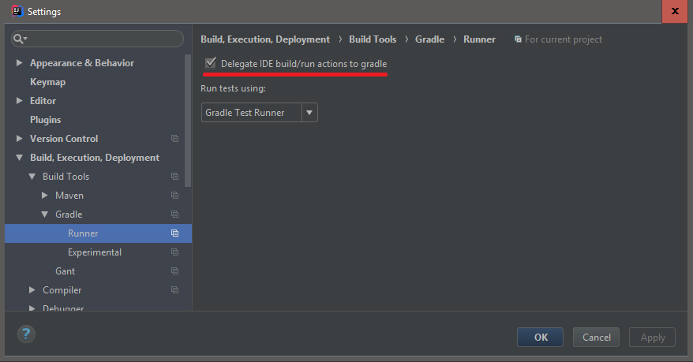
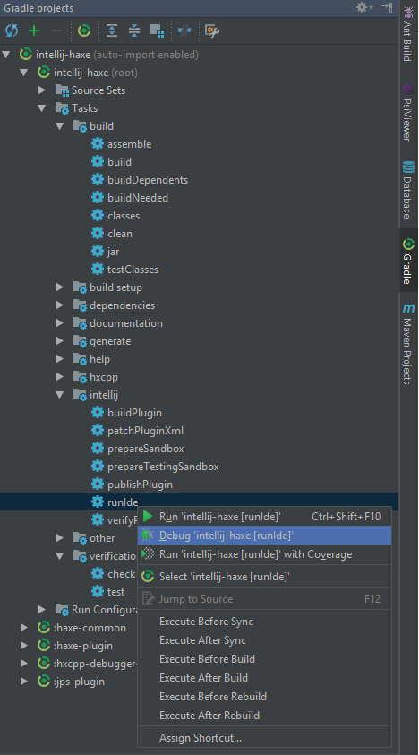
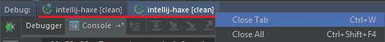

Contributing
============

NOTE: The development team is currently supporting IDEA versions 2016 and later.
Support for version 13.1 been removed as of release 0.9.8.* &nbsp; Support for versions
14 and 15 are stopped as of release 0.11.2.

## Reporting errors  
------------------

Things that will help us fix your bug:

- A minimal code example. For example if you have some completion issue, you can add the simplest Haxe that
can reproduce the issue.

- We’d like to know your:
    - Plugin version (very important!)
    - IDEA version
    - OS and OS version
    - JDK version

- Check if the bug already exists at the [HaxeFoundation repository](https://github.com/HaxeFoundation/intellij-haxe/issues).
 If it does, add your example to the discussion.

## Development Environment
-------------------------

You will need the release version of Intellij IDEA Ultimate 2016.1 or later to develop the plugin.
*There are reports that you can develop with IDEA Community Edition, though extended functionality such as
diagrams and hierarchy panels will not be available and you wont be able to test their Haxe equivalents.*

### Plugins
Install the following plugins [from Intellij IDEA plugin manager](https://www.jetbrains.com/idea/plugins/).

#### Required
- Plugin DevKit
- UI Designer
- gradle Support
- Grammar-Kit (for bnf compilation) version 1.2.0. (Later versions are not backward compatible with IDEA 14.)

#### Testing
- JUnit

#### Optional, install if you want to modify lexer/parser:
- JFlex (for lexer compilation)

IntelliJ IDEA uses the Grammar-Kit plugin to generate its lexer and parser for Haxe and HXML.
The grammar file for Haxe is [haxe.bnf](https://github.com/HaxeFoundation/intellij-haxe/blob/develop/grammar/haxe.bnf).
The grammar file for HXML is [hxml.bnf](https://github.com/HaxeFoundation/intellij-haxe/blob/develop/grammar/hxml.bnf).

#### Enable the PSI Viewer
In versions 13 and later, the PsiViewer is pre-installed, and it is not 
displayed in the plugins list.  Two menu items under the Tools menu 
(View PSI; View PSI of Current File) will appear if the current project 
uses a plugin SDK.  However, that is not useful when you're ''testing'' 
a plugin using another project.  To always have the menu items available, 
add the following lines to the end of the 
`${IDEA_INSTALLATION_DIRECTORY}/bin/idea.properties` file 
(as directed here: [http://www.jetbrains.com/idea/webhelp/viewing-psi-structure.html](http://www.jetbrains.com/idea/webhelp/viewing-psi-structure.html)).


    #-----------------------------------------------------------------------
    # Allow the PSI viewer to be available to all projects.
    #-----------------------------------------------------------------------
    idea.is.internal=true


Sometimes, when testing, the secondary instance of IDEA (running the plugin you're debugging) won't turn
on the PSI viewer when that property is actually set.  You can always enable it by adding
  `-Didea.is.internal=true`
to the "VM Options" field in the 'Run->Edit Configurations...' dialog.

#### Disable ProcessCanceledExceptions

Eventually, you may run into the frustrating situation where your stepping takes longer than
IDEA's timeout and will try to cancel the process you're debugging.  This can be disabled by adding
  `-Didea.ProcessCanceledException=disabled`
to the same "VM Options" field.

See [JetBrains' documentation for the 'idea.properties' file.](https://www.jetbrains.com/help/idea/2017.1/file-idea-properties.html) for
other goodies and their suggested methods for modifying properties.

#### Incompatibilities
Do NOT install the haxe support plugin if you want to hack on it.  The installed plugin will be loaded and
override your newly built one.  Running the "Haxe" plugin can only use the version you've built if there
isn't one already in place.  (Don't worry, when you are running or debugging, the plugin support is
enabled in the test instance of Idea that is launched.)

### Steps to configure a IntelliJ Platform Plugin SDK:
> This step should no longer be necessary when using gradle to build and run Ide and tests.
> The gradle-intellij-plugin should configure all necessary dependencies for you
- Open Module Settings
- SDKs -> + button -> IntelliJ Platform Plugin SDK -> Choose a folder with IntelliJ Ultimate(!) or *.App on Mac
- Go to the SDK’s settings page -> Classpath tab -> + button(upper right corner or bottom left corner in IntelliJ 14) -> add plugins: flex
- To add a plugin go to IntelliJ IDEA folder/plugins/<plugin-name>/lib and choose all jars
- Add *all* libraries from <your_IDEA_install_directory>/lib directory.  Do this after each upgrade, too,
particularly if you see ClassNotFound exceptions when attempting to run the plugin.

### Video tutorials from [as3Boyan](https://github.com/as3boyan)

*Installation*  
- [Setup IntellliJ IDEA for Haxe Plugin development](http://youtu.be/MwrzdBFaZkc)

*How to write plugin code*    
- [How to develop intention actions.](https://www.youtube.com/watch?v=-mY_DpzVDFs)   
- [How to extend HXML completion using haxelib.](https://www.youtube.com/watch?v=B8zOSEEK7As)  
- [How to build a completion contributor for HXML.](https://www.youtube.com/watch?v=UBxuj2ToizY)  

## Building
----------

Contributors are expected to have and build against each of the latest 
sub-release of each major and minor version of IDEA that is supported 
by the plugin team.  At the time of this writing, that would be 2016.1.4, 
2016.2.5, 2016.3.7, 2017.1.5, and 2017.2.6, and 2017.3.3.
As new versions are released this will continue to be
a moving target, as we attempt to keep up with the development community.

We do NOT expect contributors to keep up to date with EAP releases, nor does 
the team support them (though the plugin may work, and will usually install).

*IDEA releases 2016 and later require JDK 8.  That build environment has
been successfully used for this plugin, targeting Java6 for builds prior to 2016.x.*

#### Gradle Builds

As we noted in the [README](./README.md) file, you can build and test the 
plugin without ever installing IDEA Ultimate.  The ```gradlew``` command will 
do everything for you. The first time you run the command for a given IDEA version 
it will download  IDEA and all dependencies for that version. Any later executions 
of this command  should  execute much faster as it will reused the already downloaded files.

If for some reason a download gets corrupted or you run into problems building there's a 
set of clean tasks you can run that will removed cached versions and  in most cases these will solve your problem. 

To remove downloaded dependencies run (will be downloaded again next time you build).
```
gradlew removeTools 
```

To remove downloaded IDEA versions.
```
gradlew removeIdeaCache 
```

To remove compiled code and generated sources.
```
gradlew clean 
```

As mentioned above it is possible to build and test the plugin without the needed to install IDEA.
If you want to test the plugin in intelliJ simply run the command below and it should start a session 
with the IDEA version that you provide
```
gradlew runIde -PtargetVersion=<IDEA_VERSION>
```


To verify that your changes does not break any other features you should run the test suite and verify IDEA can read the plugin
```
./gradlew test verifyPlugin
```

If those complete without error, you have a compilable set of changes which can 
be considered for merging.


#### IDEA builds

The preferred way for casual developers to build the plugin is using the
build that they use for their other work.  That is, casual developers shouldn't need to
be using the command line at all, they should use the normal Build menu commands 
(or their shortcuts) that they are used to.

For these to work with IDEA you will have to tell IDEA to delegate te build job to Gradle
You should find the option to do this under : Build -> Build tools -> Gradle -> Runner  




The Gradle Project panel might be a bit overwhelming for those who are not used to Gradle
There are 4 gradle tasks that you will probably use frequently and that is worth mentioning
all these tasks  can be found under project root (intellij-haxe)

- build - *Will build the plugin and create a plugin Jar in the root of the project*
- test - *will build and run all tests in IDEA and show you the results in the test panel*
- clean - *will remove all compiled and generated code*
- runIde - *will build the plugin, prepare an sandbox and start an instance of IDEA with your plugin*

You can chose between run and debug by right clicking on the task you want to execute 


###### Syntax Errors
Its recommended to build the project first before you start writing code as some parts of the project 
uses generated code and you may experience syntax errors in your code editor, the code will however
build just fine as these sources are generated when the project is built.
 
If you just want to generate the nessesary sources you can run the `generateSources` gradle task.

## Debugging
-------

When debugging, a secondary instance of IDEA starts up and loads the plugin.  At that
point, the original instance of IDEA is in debug mode and has all of the normal java
debugging functionality.  You will find yourself swapping back and forth between the
two instances quite a lot.  Note that it's very easy to think that IDEA has hung in 
the second instance, when, in reality, you have hit a breakpoint in the first instance.

It is also annoying that focus isn't necessarily changed correctly when swapping
between two instances.  It is helpful to reset focus by minimizing the second 
instance (using the mouse :/ ) and restoring it.

If, while debugging, you find that you are missing source files for 
the /gen tree, then you need to quit and do a local build to get those generated sources
available for your tree.  (On the other hand, since the files are auto-generated, they
likely won't be much more help than the decompiled class files.)

## Testing
_______

Testing can be performed on the command line via gradle, or within the IDE itself.  To
test on the command line, the command is:

```
./gradlew test -PtargetVersion=<IDEA_VERSION>
```

If you have trouble running tests from within the IDE make sure you have configured the IDE to 
delegate run and build actions to Gradle as explained under [IDEA builds](#IDEA-builds)

 
The requirements for testing the plugin are the same as for building the plugin.
You can run tests within IDEA from the gradle pane as well, with the output being
identical to that from the command line.


## Build troubleshooting
Once in a while you might experience that your build/run/debug/test task fails and the error reported seems to be related to gradle.
This can sometimes happen when you have multiple gradle targets open at the same time. Check your debug and run panels and try to close
any extra tabs that might be open.



## Updating Grammar Files
______________________

If you change the haxe.bnf or hxml.bnf files, you no longer have to (re)generate
the parsing files; that is now done through gradle, and gradle will look for changes
before every build, incremental or full.  (It will only rebuild the
files if they are out of date.)

The grammar-kit plugin is used to generate the parser files.  *Version 1.2.0 
works well for this project and creates identical code for IDEA versions 14.0 through 2016.2.
Versions 2.x work intermittently (a bug has been filed).
Using 1.1.x versions, we saw a bug appear where APISs that expect discrete elements all-of-a-sudden change to
requiring list type return values, or vice versa.  If you see this type of error and find yourself
fixing non-generated code to match the generated code, don't do it.  You will find
yourself changing it back and forth.  The quickest workaround for the bug
is to restart IDEA.  That usually fixes it.  Since the bug is intermittent,
it may work one or a hundred times just to start failing.  (We've never seen it
recover.)  That said, version 1.2.0 and later appear stable.  However, they use
the list-based APIs, so we have converted the code to that style, however incorrect it may be.*

To regenerate, make your changes to the .bnf files and build the project, either via IDEA or
the command line.  That simple. 
Parser files will be generated to the project's /gen tree.  Since the /gen tree is no longer
checked into the source tree, you don't have to worry about copyrights, etc.  Just don't try
and add them back into the git repository.

## Contributing your changes
_________________________

### Workflow

Goals:

- Minimize overhead
- Define the process concretely, so that we can agree on how to work together.
- Document this so that the community can easily help.

#### Where we are working:

- Future work will take place on the HaxeFoundation/intellij-haxe/master branch (really, using short-lived 
local branches off of that).

#### Where we will release:

- Releases will (usually, simultaneously) occur on the HaxeFoundation/intellij-haxe repo, 
jetbrains/intellij-haxe repo, and the IDEA plugin repository.  Releases will be made 
through the github release mechanism.  Binary output (e.g. intellij-haxe.jar) is no longer
kept in the source tree in the repository.

#### How we will release:

- When appropriate (there are changes that merit a new version), we will update the 
release notes, commit, tag the build, and create a pull request to JetBrains.  Updating
the release notes primarily means adding release notes to src/META-INF/plugin.xml, and
echoing them to CHANGELOG.md.
- A github "release" will be created on the HaxeFoundation/intellij-haxe repository.  Binary (.jar) files 
for all currently built Idea target versions of the plugin will be added to the release.
- The released plugin (.jar files)  will be uploaded to the JetBrains IntelliJ IDEA plugin 
repository.

#### Release environments:

- Haxe Foundation releases will be built and smoke tested for the following environments:  
   OS: Linux(Ubuntu14.04), OSX, Windows  
   JVM: Sun Java 1.8 compilers  
   IDEA versions: 2016.3.7, 2017.1.5, 2017.2.6, 2017.3.3.
- JetBrains releases will be copies of the Haxe Foundation releases.  

#### Who will test:

- Interested Community members will test the HaxeFoundation release environments.  
  Community members will ensure that the product can be loaded into the various 
  environments prior to release.  Lack of interest from the community may delay releases.

#### Unit tests:

- Unit tests will be run and must pass with every commit.  We are using Travis-ci to 
  automate this process.  No merge will be considered or approved unless it passes 
  unit tests cleanly.  (Note: There are no automated Windows continuous integration builds.  We
  would like to add this functionality.  Any volunteers?)

#### Release Timing

As far as updates the IDEA repository go, the team will agree on releases as necessary and as critical
errors are fixed.  Optimally, we should create a release about every month to six weeks.
  
#### Release Process

Once we have a stable code base and would like to create a release, you should get consensus from
the current primary developers.  Once you have agreement on the release number, this is the process:

1. Make sure that all relevant outstanding pull requests have been merged into the master branch.

2. Review the git change log and make sure that all relevant updates are reflected in the plugin's 
change log.  The change log appears in two places: src/META-INF/plugin.xml and CHANGELOG.md.  The 
former is what the IDEA user will see in the plugin description page and in the IDEA plugin 
repository.  The latter is what github users will see.  You will also need the change log 
for the releases page later on.   To keep things in sync, it is easiest to edit the plugin.xml, 
then copy the relevant section to CHANGELOG.md.

3. Update the CONTRIBUTORS.md file: `./update_contributors.sh` in the project root.

3. Commit the change logs, merge them into master, and then pull the master branch locally so that you
can test and tag it.

4. Build *each* of the releases: For each release, run make (or your local equivalent) 
    - `./gradlew buildPlugin -PtargetVersion=2016.3.5`
    - `./gradlew buildPlugin -PtargetVersion=2017.2`
    - `./gradlew buildPlugin -PtargetVersion=2017.3`
    - `./gradlew buildPlugin -PtargetVersion=2018.1`

5. Smoke test *each* of the releases.  A smoke test includes loading the releases in a primary instance of IDEA and verifying 
basic functionality:  
    - Reload a project
    - Compile a project
    - Show class hierarchy
    - Copy/Paste a block
    - Invoke completion
    - Visually verify coloring
    - Goto definition
    - Find occurrences
    - Start the debugger
    - Run the project

5. Run the unit tests on all versions:
    - `./gradlew test -PtargetVersion=2016.3.5`, etc.
    
4. Tag the commit using the agreed upon release number: `git tag -a 0.9.5 -m "Release 0.9.5"`

5. Push the release back up to master: `git push origin master; git push --tags origin master`

6. Create a release on github, using the tag you just created:
    - [https://github.com/HaxeFoundation/intellij-haxe/releases](https://github.com/HaxeFoundation/intellij-haxe/releases)
    - Sign in and draft a new release, using the tag you just added. 
    - Upload all of the release jars to the release.
    - Add the change notes for the most recent changes (between this release and the last).
    - Mark it as pre-release if appropriate.
    - Submit

7. Create a Pull Request to pull all of the current changes up to the JetBrains/intellij-haxe/master
repository.  Add shoutouts to @as3Boyan and @EBatTiVo to the pull request.

8. Upload the jars to the IDEA plugin repository 
[https://plugins.jetbrains.com/plugin/6873?pr=idea](https://plugins.jetbrains.com/plugin/6873?pr=idea)

### Code Review and Commit Process

We, as a team, are reviewing each other’s code publicly on github.  To do so we’re using the common 
git practice of creating short-lived work branches, and then creating pull requests.
  
Here’s how:

1. Create a new (or use an existing) branch for any work that you do.  The critical thing here is not
 to do your work directly on the master branch.
2. Make and test your changes.
3. Create unit tests for your changes.  (See the testSrc and testData directories for examples.)
4. Update src/META-INF/plugin.xml with the change description in the top (Usually "Unreleased changes"
section).
5. When your work is complete, merge current sources from master up to your branch, re-test locally,
then push your branch to HaxeFoundation/intellij-haxe.  Travis-ci will automatically start a build and test cycle
applying your changes against the master branch.
6. Create a pull request, and wait for comments.
7. If you get comments that require changes, address those and return to step 2.
8. When you get an “OK to merge,” or "approved," message from anyone on the team: Eric, @EricBishton; Ilya Malanin, @Mayakwd; Boyan, @as3boyan;
or Ilya Kuzmenko, @EliasKu (others as they become regular contributors,) go ahead
and merge your changes to master.  A clean merge requires no further testing,
as Travis-ci will do it for you.  However any build break must be addressed immediately.  A build
that has conflicts requires manual resolution and must be re-tested locally prior to push.  For regular
team members, the original requester will be the person to merge since they are best suited to address
conflicts.  Merges from occasional contributors will be merged by a team member as time and
resource becomes available.
9. Check the Travis-ci output (https://travis-ci.org/HaxeFoundation/intellij-haxe/builds) to ensure that
everything built correctly. 


