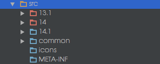

Contributing
============

*NOTE: TiVo and the Haxe Foundation are moving our development focus to IDEA version 14 and later.
Support for version 13.1 is not being removed, but will no longer be tested or regarded as
development progresses.*

##Reporting errors  
------------------

Things that will help us fix your bug:

- A minimal code example. For example if you have some completion issue, you can add the simplest Haxe that
can reproduce the issue.

- We’d like to know your:
    - Plugin version (very important!)
    - IDEA version
    - OS and OS version
    - JDK version

- Check if the bug already exists at the [TiVo repository](https://github.com/tivo/intellij-haxe/issues).
 If it does, add your example to the discussion.

##Development Environment
-------------------------

You will need the release version of Intellij IDEA Ultimate 13.1, 14.0, or later to develop the plugin.

###Plugins
Install the following plugins [from Intellij IDEA plugin manager](https://www.jetbrains.com/idea/plugins/).

####Required
- Plugin DevKit
- UI Designer
- Ant Support

####Testing
- JUnit

####Optional, install if you want to modify lexer/parser:
- Grammar-Kit (for bnf compilation) version 1.2.0.1 or later.
- JFlex (for lexer compilation)
- PsiViewer (for testing grammar)

IntelliJ IDEA uses the Grammar-Kit plugin to generate its lexer and parser for Haxe and HXML.
The grammar file for Haxe is [haxe.bnf](https://github.com/JetBrains/intellij-haxe/blob/master/grammar/haxe.bnf).
The grammar file for HXML is [hxml.bnf](https://github.com/JetBrains/intellij-haxe/blob/master/src/com/intellij/plugins/haxe/hxml/hxml.bnf).

#### Enable the PSI Viewer
In versions 13 and later, the PsiViewer is pre-installed, and it is not 
displayed in the plugins list.  Two menu items under the Tools menu 
(View PSI; View PSI of Current File) will appear if the current project 
uses a plugin SDK.  However, that is not useful when you're ''testing'' 
a plugin using another project.  To always have the menu items available, 
add the following lines to the end of the 
`${IDEA_INSTALLATION_DIRECTORY}/bin/idea.properties` file 
(as directed here: [http://www.jetbrains.com/idea/webhelp/viewing-psi-structure.html](http://www.jetbrains.com/idea/webhelp/viewing-psi-structure.html)).


    #-----------------------------------------------------------------------
    # Allow the PSI viewer to be available to all projects.
    #-----------------------------------------------------------------------
    idea.is.internal=true


####Incompatibilities
Do NOT install the haxe support plugin if you want to hack on it.  The installed plugin will be loaded and
override your newly built one.  Running the "Haxe" plugin can only use the version you've built if there
isn't one already in place.  (Don't worry, when you are running or debugging, the plugin support is
enabled in the test instance of Idea that is launched.)

###Steps to configure a IntelliJ Platform Plugin SDK:
- Open Module Settings
- SDKs -> + button -> IntelliJ Platform Plugin SDK -> Choose a folder with IntelliJ Ultimate(!) or *.App on Mac
- Go to the SDK’s settings page -> Classpath tab -> + button(upper right corner or bottom left corner in IntelliJ 14) -> add plugins: flex
- To add a plugin go to IntelliJ IDEA folder/plugins/<plugin-name>/lib and choose all jars
- Add *all* libraries from <your_IDEA_install_directory>/lib directory.  Do this after each upgrade, too,
particularly if you see ClassNotFound exceptions when attempting to run the plugin.

###Video tutorials from [as3Boyan](https://github.com/as3boyan)

*Installation*  
- [Setup IntellliJ IDEA for Haxe Plugin development](http://youtu.be/MwrzdBFaZkc)

*How to write plugin code*    
- [How to develop intention actions.](https://www.youtube.com/watch?v=-mY_DpzVDFs)   
- [How to extend HXML completion using haxelib.](https://www.youtube.com/watch?v=B8zOSEEK7As)  
- [How to build a completion contributor for HXML.](https://www.youtube.com/watch?v=UBxuj2ToizY)  

##Building
----------

Contributors are expected to have and build against each of the latest 
sub-release of each major and minor version of IDEA that is supported 
by the plugin team.  At the time of this writing, that would be 14.0.4, 
and 14.1.1.  As new versions are released this will continue to be 
a moving target, as we attempt to keep up with the development community.

We do NOT expect contributors to keep up to date with EAP releases, nor does 
the team support them (though the plugin may work, and will usually install).

####Ant Builds

As we noted in the [README](./README.md) file, you can build and test the 
plugin without ever installing IDEA Ultimate.  The ```make``` command does
this for you -- every time you build.  That is rather inefficient and can 
be time consuming, particularly when we, as developers, generally already 
have the software installed.

The ant command line build skips the shell scripting (thus fetching/downloaing
Idea) and make entirely.  It is the quickest way to build and test for multiple 
versions.  It is called like so:

```
ant -Didea.ultimate.build=<path_to_idea_installation>
```

or, for test builds:

```
ant -Didea.ultimate.build=<path_to_idea_installation> -f build-test.xml
```

The default target in each of the build files (the ant default `build.xml` and 
`build-test.xml`) will build the `package` and `test` targets respectively.  If
those complete without error, you have a compilable set of changes which can 
be considered for merging.

Note that you have to set the path to the appropriate idea installation.
The ant task will read the `build.txt` file from the installation directory
and parse it to determine the build target and which properties to use.  Thus,
you, as a developer, don't have to track which version of IDEA SDK you built
with which set of properties.  The correct properties will always be selected
for you.  (The ant file common.xml does this bit of trickery for builds
from within IDEA as well; you don't have to set any command switches when
you run tasks from the ant pane.)

To do that bit of magic idea must be able to find the installation and
the `build.txt` file.  If it doesn't you will see this error:

    IDEA installation not found.

    Either '${idea.ultimate.build}' does not exist, or it does not appear
    to be a normal IDEA installation.  (It should contain a build.txt file.)
    See the description section at the top of this file (common.xml) for more
    information.

    You can tell this build where to find to your IDEA Ultimate build directory
    by adding "-Didea.ultimate.build=path_to_your_IDEA_installation" to the
    command line, where path_to_your_IDEA_installation is a directory on your
    local machine.

    Alternately, you can run this build by executing the build.sh file in the
    project root directory, which will fetch a new installation for you.

The algorithm works like this:  
Pick the first instance of idea.ultimate.build that is set from the following locations (in order):  
- the command line (e.g. includes `-Didea.ultimate.build=<path>`)  
- `local-build-overrides.xml` file  
- the grandparent directory from which ant is running, if ant is running from 
(`${ant.home}` is set to) a directory named `**/lib/ant` and the file `build.txt` 
exists in the grandparent directory.  
- `./idea-IU/` relative to the project root directory.

Once the `${idea.ultimate.build}` property is set, the existence of `build.txt` is checked. 
If `build.txt` cannot be found, then the error message you see above is displayed.

In any case, `build.txt` MUST exist in your installation directory.  If it does not, 
then your installation is corrupt.  You should consider re-installing IDEA.  Failing that,
you can create one. It is a single line file with the following format:

* A two character product prefix (e.g. IU for IDEA Ultimate, IC for community edition, and so on)  
* a dash ("-")  
* code line ID (e.g. 135 for IDEA 13.1, 139 for IDEA 14, 141 for IDEA 14.1)  
* a dot (".")  
* build number (e.g. 1286)    
* a dot -- optional, but mandatory if a patch number is supplied  
* patch number -- optional 

Example:  
```
IU-135.1286
```

or  
```
IC-141.1117.8
```

#####local-build-overrides.xml

The ant file `./local-build-overrides.xml` is intended to contain your IDEA paths
and any other modifications and tasks that you want to include in your builds.  The 
most important entry is the path to your IDEA installation.  That way there is no
guessing on the part of `common.xml`, and you don't have to type it on the command
line all of the time.  Plus, your extra build goodies become available inside of IDEA.

Here is a minimalist example:

    <project name="local-overrides">
      <property name="idea.ultimate.build" location="/home/username/intellij_idea/idea-IU-135.1286/" />
    </project>

Here is one from one of our team members:

    <project name="local-overrides">
      <echo>
        Including local overrides...
      </echo>
    
      <property environment="env"/>
      <property name="idea.installation.dir" location="${env.HOME}/intellij_idea" />
      <condition property="idea.ultimate.build" value="${idea.installation.dir}/idea-IU-135.1286/" >
        <matches pattern="13" string="${version}"/>
      </condition>
      <condition property="idea.ultimate.build" value="${idea.installation.dir}/idea-IU-141.177.4/">
        <matches pattern="14.1" string="${version}"/>
      </condition>
      <condition property="idea.ultimate.build" value="${idea.installation.dir}/idea-IU-139.1117.1/">
        <matches pattern="14" string="${version}"/>
      </condition>
    
    </project>

Using this latter file, when started using the command `ant -Dversion=13`, the 
plugin is built using the IDEA SDK found at `/home/user/intellij_idea/idea-IU-135.1286`.
 
#####Generation of META-INF files

Since each version of IDEA has it's own requirements, should not be built
using code that is specific to another version, and should not be able
to load into a version of IDEA other than which it was intended, we have 
to update the src/META-INF files with data appropriate to the version
being built.  Before compilation, the "metainf" ant task runs and fills 
in the blanks (well... the areas between @...@ signs) in plugin.xml with 
the aforementioned values.  The generation algorithm copies the src/META-INF 
files to gen/META-INF as part of this process, and the project uses the 
copied files. The properties are defined in properties files in the 
project root directory (e.g. idea_v13.properties).

####IDEA builds

The preferred way for casual developers to build the plugin is using the
build that they use for their other work.  That is, casual developers shouldn't
be using the command line at all and generally shouldn't use the ant targets
either.  They should use the normal Build menu commands (or their shortcuts).

That said, builds from within IDEA use ant as well: always for preparation of the META-INF files;
sometimes for building, depending upon how you launch the build.  In all cases,
before compilation, the "metainf" ant task runs and fills in the blanks (well... the areas 
between @...@ signs) in plugin.xml with values appropriate to the version of IDEA 
that is running the build.  (It is assumes that you want a build that you can 
run in your current installation.)  This happens whether you start the build 
from an ant task (from the "Ant Build" pane) or from the Build menu.

If you run the "package" or "test" targets from the ant pane, you get the same 
behavior that you do from the command line ant build, except that the "Messages" 
window shows the ant task output as each dependent task is run.  If you were 
to expand all tasks, you will see that the output is identical to the command line.

However, if you run from the build menu, only the plugin.xml is updated (or
whatever "metainf" and all of it's dependent tasks do now).  After that, the
normal IDEA make, build, or what-have-you from the Build menu runs and does
its thing.  You will see a few ant messages scroll by, and then the normal
IDEA output will be seen.

#####Yes, Build Errors Are Expected

######Syntax Errors
OK. If you haven't changed anything, this most likely isn't an issue of code. 
It's an issue of updating your project structure. Since all of the versions 
of the plugin build from a single source base, the project must be set up correctly. 
We decided to make the default settings be correct for IDEA v14.1. However, to 
build other versions, you can either use the ant builds (see 
![Ant Builds][Ant Builds] above), or you can change 
the project structure to match the environment you're trying to build.

So, for 13.1.6, open "File->Project Structure->Module->intellij-haxe->Sources(tab)," and change this:  


to this:  


Then try to rebuild.

Unfortunately, IDEA will not allow multiple modules (.iml files) with the same
source root, so we can't have a configuration for each build type.

######IDEA Installation Not Found
In order to get the above message while running inside of IDEA, your `build.txt` 
file must be missing, or you must have overridden IDEA's default ant installation.
(Have you set `ANT_HOME` in your environment?)  Idea ships with an ant installation 
and that is normally what is used when running ant builds -- thus the check 
for `${ant.home}/../../build.txt` in `common.xml`.

You can either restore the ant defaults inside of idea, (unset ANT_HOME before you
start IDEA?)  or, the best option, add a property entry to local-build-overrides.  
See the above discussion regarding [local-build-overrides.xml].


##Testing
_______

Testing can be performed on the command line via ant, or within the IDE itself.  To
test on the command line, the command is:

```
ant -Didea.ultimate.build=<path_to_idea_installation> -f build-test.xml
```

The requirements for testing the plugin are the same as for building the plugin.
You can run tests within IDEA from the ant pane as well, with the output being
identical to that from the command line.

IDEA's test support is really very nice, and you can't use it with the ant build.
Running them from within idea (the "Build" menu) allows for nicer reporting, 
allows debugging, and allows discrete tests to be run.  Ant will still be 
called to generate needed files prior to compiling the tests, so ant needs 
to be set up correctly.  You will have a much nicer and more productive testing 
and debugging sessions running tests with the native support.

##Updating Grammar Files
______________________

If you change the haxe.bnf or hxml.bnf files, you must (re)generate the parsing files.

The grammar-kit plugin is used to generate the parser files.  *Versions 1.1.x 
work well for this project.  Versions 2.x work intermittently (a bug has been filed).
You will see a bug appear where APISs that expect discrete elements all-of-a-sudden change to
requiring list type return values.  If you see this type of error and find yourself
fixing non-generated code to match the generated code, don't do it.  You will find
yourself changing it back and forth.  The quickest workaround for the bug
is to restart IDEA.  That usually fixes it.  Since the bug is intermittent,
it may work one or a hundred times just to start failing.  (We've never seen it
recover.)  But all of that can be avoided by running the older versions.*

To regenerate, make your local changes and then press Ctrl+G.  You can compile
and test with them.  Do NOT check those files in until you have updated the
comments.  (Otherwise, *every* file will appear updated.)

*(NOTE: To work around a bug in IDEA, it is necessary to change focus to another
application and then back to IDEA before updating the comments.  Otherwise,
the process doesn’t do anything.)*

To fix the comments:
- Open the project window within intellij, select and 
 the right-click on the gen/ tree.  
- Click on the ‘Update Copyright’ item.  (Should be the third from the bottom.  Sometimes you have to re-open the
 context menu.)  
- In the ‘Update copyright scope’ dialog, select the “Directory ‘intellij-haxe...’” item and press OK.  
 In a moment, all of the copyrights will have been updated.  A code comparison (or ‘git status’) will
 then show only those files that really changed.


##Contributing your changes
_________________________

###Workflow

Goals:

- Minimize overhead
- Define the process concretely, so that we can agree on how to work together.
- Document this so that the community can easily help.

####Where we are working:

- Future work will take place on the tivo/intellij-haxe/master branch (really, using short-lived 
local branches off of that).

####Where we will release:

- Releases will (usually, simultaneously) occur on the tivo/intellij-haxe repo, 
jetbrains/intellij-haxe repo, and the IDEA plugin repository.  Releases will be made 
through the github release mechanism.  Binary output (e.g. intellij-haxe.jar) is no longer
kept in the source tree in the repository.

####How we will release:

- When appropriate (there are changes that merit a new version), we will update the 
release notes, commit, tag the build, and create a pull request to JetBrains.  Updating
the release notes primarily means adding release notes to src/META-INF/plugin.xml, and
echoing them to CHANGELOG.md.
- A github "release" will be created on the tivo/intellij-haxe repository.  Binary (.jar) files 
for all currently built Idea target versions of the plugin will be added to the release.
- The released plugin (.jar files)  will be uploaded to the JetBrains IntelliJ IDEA plugin 
repository.

####Release environments:

- TiVo releases will be built and tested for the following environments:  
   OS: Linux(Ubuntu14.04 and Centos6.5), OSX  
   JVM: Sun Java 1.6  
   IDEA versions: 14, 14.1 (release versions  EAP will not be tracked).  
- JetBrains releases will be built and smoke tested for the following environments:  
   OS: Linux(Ubuntu14.04), OSX, Windows  
   JVM: Sun Java 1.6 target, using Sun Java 1.8 compilers (because the Java 1.6 and 1.7 
   maintenance windows have closed)  
   IDEA versions: 14, 14.1 (release versions)  

####Who will test:

- TiVo and Haxe Foundation members will test the TiVo release environment.
- Interested Community members will test the JetBrains release environments.  TiVo 
  and Haxe Foundation members will ensure that the product can be loaded into the various 
  environments prior to release.

####Unit tests:

- Unit tests will be run and must pass with every commit.  We are using Travis-ci to 
  automate this process.  No merge will be considered or approved unless it passes 
  unit tests cleanly.

####Release Timing

As far as updates the IDEA repository go, the team will agree on releases as necessary and as critical
errors are fixed.  Optimally, we should create a release about every month to six weeks.
  
####Release Process

Once we have a stable code base and would like to create a release, you should get consensus from
the current primary developers.  Once you have agreement on the release number, this is the process:

1. Make sure that all relevant outstanding pull requests have been merged into the master branch.

2. Review the git change log and make sure that all relevant updates are reflected in the plugin's 
change log.  The change log appears in two places: src/META-INF/plugin.xml and CHANGELOG.md.  The 
former is what the IDEA user will see in the plugin description page and in the IDEA plugin 
repository.  The latter is what github users will see.  You will also need the change log 
for the releases page later on.   To keep things in sync, it is easiest to edit the plugin.xml, 
then copy the relevant section to CHANGELOG.md.

3. Update the CONTRIBUTORS.md file: `./update_contributors.sh` in the project root.

3. Commit the change logs, merge them into master, and then pull the master branch locally so that you
can test and tag it.

4. Build *each* of the releases: For each release, run make (or your local equivalent) 
    - `IDEA_VERSION=13.1.6 make`, or `ant -Didea.ultimate.build=<path_to_intellij_13.1.6>` 
    - `IDEA_VERSION=14.0.4 make`
    - `IDEA_VERSION=14.1.1 make`

5. Smoke test *each* of the releases.  A smoke test includes loading the releases in a primary instance of IDEA and verifying 
basic functionality:  
    - Reload a project
    - Compile a project
    - Show class hierarchy
    - Copy/Paste a block
    - Invoke completion
    - Visually verify coloring
    - Goto definition
    - Find occurrences
    - Start the debugger
    - Run the project

5. Run the unit tests on all versions:
    - `IDEA_VERSION=13.1.6 make test`, etc.
    - or `ant -Dintellij.ultimate.build=<path_to_intellij_13.1.6> -f build-test.xml`, etc.
    
4. Tag the commit using the agreed upon release number: `git tag -a 0.9.5 -m "Release 0.9.5"`

5. Push the release back up to master: `git push origin master; git push --tags origin master`

6. Create a release on github, using the tag you just created:
    - [https://github.com/tivo/intellij-haxe/releases](https://github.com/tivo/intellij-haxe/releases)
    - Sign in and draft a new release, using the tag you just added. 
    - Upload all of the release jars to the release.
    - Add the change notes for the most recent changes (between this release and the last).
    - Mark it as pre-release if appropriate.
    - Submit

7. Create a Pull Request to pull all of the current changes up to the JetBrains/intellij-haxe/master
repository.  Add a shoutouts to @as3Boyan and @EBatTiVo to the pull request.

8. Upload the jars to the IDEA plugin repository 
[https://plugins.jetbrains.com/plugin/6873?pr=idea](https://plugins.jetbrains.com/plugin/6873?pr=idea)

###Code Review and Commit Process

We, as a team, are reviewing each other’s code publicly on github.  To do so we’re using the common 
git practice of creating short-lived work branches, and then creating pull requests.
  
Here’s how:

1. Create a new (or use an existing) branch for any work that you do.  The critical thing here is not
 to do your work directly on the master branch.
2. Make and test your changes.
3. When your work is complete, merge current sources from master up to your branch, re-test locally, 
then push your branch to TiVo/intellij-haxe.  Travis-ci will automatically start a build and test cycle
applying your changes against the master branch.
4. Create a pull request, and wait for comments.
5. If you get comments that require changes, address those and return to step 2.
6. When you get an “OK to merge,” or "approved," message from anyone on the team: Boyan, @as3boyan; 
Eric, @EBatTiVo; Srikanth, @sganapavarapu; Yannick, @yahnick, others as they become regular 
contributors), go ahead and merge your changes to master.  A clean merge requires no further testing,
as Travis-ci will do it for you.  However any build break must be addressed immediately.  A build 
that has conflicts requires manual resolution and must be re-tested locally prior to push.  For regular
team members, the original requester will be the person to merge since they are best suited to address
conflicts.  Merges from occasional contributors will be merged by a team member as time and
resource becomes available.
8. Check the Travis-ci output (https://travis-ci.org/TiVo/intellij-haxe/builds) to ensure that 
everything built correctly. 

We’re also planning on setting up an automated “nightly” build that is posted somewhere so that 
interested people can get the latest without us constantly posting it to the JetBrains IDEA repository.

