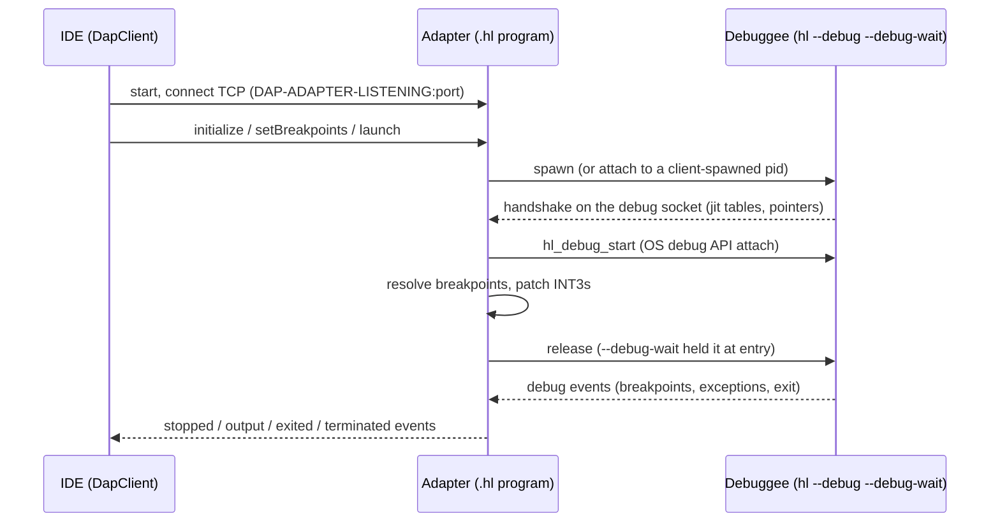
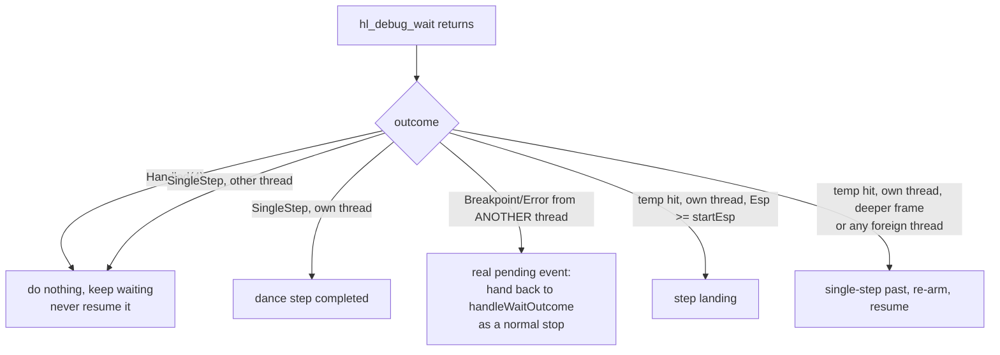
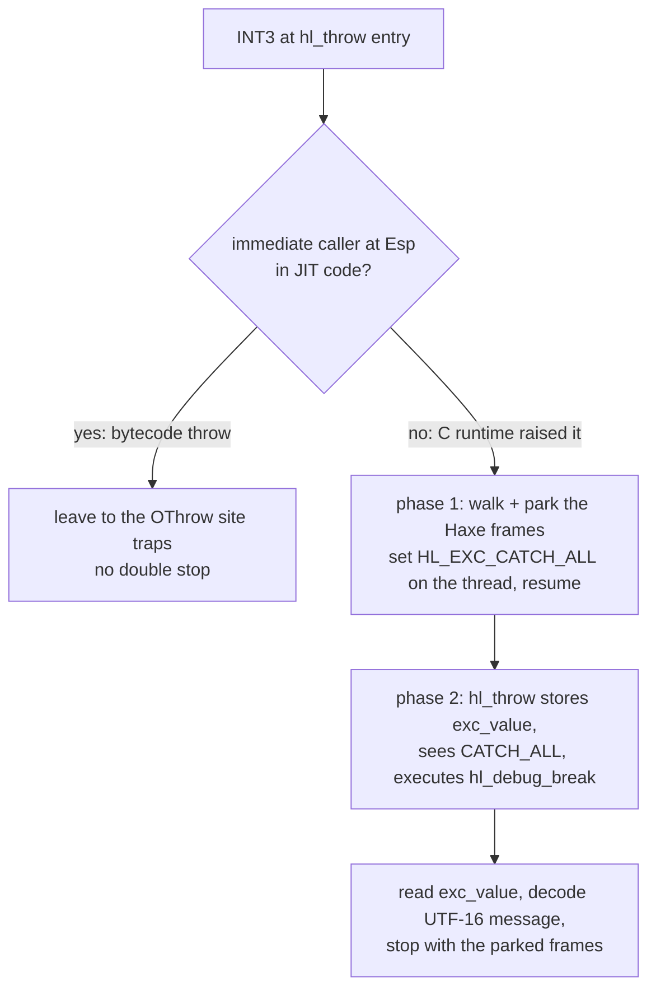

# hashlink-debug-adapter internals

A standalone DAP debug adapter for HashLink programs, written in Haxe and
compiled to HashLink bytecode — the adapter runs *on* the HashLink VM while it
debugs *another* HashLink VM out of process, through the VM's own `debug_*`
natives (memory reads, INT3 patching, single-stepping, register access). That
"HL debugging HL" arrangement is where most of the surprises in this document
come from.

This document is the entry point for anyone new to the code: how a session
connects, what is supported, the design decisions, how each feature works, and
the traps that will bite again. Build/run/test instructions and the directory
layout live in the module [README](../README.md).

The overriding invariant is: **the adapter must never block on the debuggee.**
Every rule below exists to keep that true.

## How it connects

The IDE starts the compiled adapter (`hl hl-debug-adapter.hl [--port <n>]`),
connects to the printed port, and speaks DAP over TCP. The adapter serves one
client session and exits on disconnect. Two ways to reach the debuggee:

- **Launch** (default): the adapter spawns
  `hl --debug <port> --debug-wait <program.hl>` (the `.hl` must be compiled
  with `-debug`), drains the VM's handshake from the debug socket, and
  attaches via the OS debug API. The adapter owns the child's stdio and
  forwards it as DAP `output` events.
- **Attach** (`attachPid` + `debugPort` in the launch arguments): the CLIENT
  spawns the debuggee and the adapter only attaches. Required for GUI
  debuggees — see Decisions.



The handshake carries the jit code base, function tables, globals/threads
pointers and struct-size table; combined with the `.hl` file's bytecode debug
tables (parsed with the `format` haxelib) it gives the adapter everything it
knows about the debuggee.

## Supported features

- **Line breakpoints** with conditions, verified against the bytecode debug
  tables (lines without code are rejected); breakpoints set before launch are
  answered provisionally and re-verified afterwards.
- **Stepping**: over / into / out, plus **smart step into** (`stepInTargets` —
  pick which call on the line to enter).
- **Threads**: suspend-all stops, every thread's stack and locals inspectable.
- **Stack traces** with `Class.method` names and file:line mapping.
- **Variables**: locals/arguments with correct scoping, object/struct fields,
  arrays, enums, maps (native and tree-based), anonymous structures, closures,
  Dynamic, refs, a per-frame **Registers** view.
- **Set Value** (F2) and evaluate-box assignments, including into any frame.
- **Evaluate**: full expressions — operators, calls (static, instance,
  closures), `new`, map/array indexing, string creation — watches, hover and
  conditional breakpoints all use the same interpreter.
- **Exception breakpoints**: throw-site filters plus the "HashLink VM
  Exceptions" filter for VM-raised errors (null access, out of bounds, ...).
- **Output forwarding**, clean disconnect/kill in launch mode, detach that
  leaves the debuggee running in attach mode.
- **Both bitnesses** (one adapter artifact runs on HL64 and HL32) and HL
  runtimes 1.13–1.16-nightly (verified matrix under "Version & bitness").

## Dependencies

| What | Used for |
|---|---|
| `format` haxelib (pinned by a Gradle task) | parsing the `.hl` bytecode debug tables |
| HashLink's `debug_*` natives | memory reads, INT3 patching, registers, wait loop — no additional native code |
| `:dap-protocol` Java module | the `DapClient` the plugin and tests connect with |

Building the adapter needs `haxe` on `PATH`; running it (and the integration
tests) needs a HashLink VM (`-PhashlinkBin=...`, `HASHLINK_BIN`, or `hl` on
`PATH` — tests skip when absent).

## Thread architecture

All `debug_*` OS calls run on one dedicated **session thread** (a Windows
requirement: the thread that attaches must service the debug events), which
communicates with the rest of the adapter only through queues. Around it:
the DAP reader/writer threads (socket I/O), and in launch mode two **pump
threads** draining the debuggee's stdout/stderr. The session thread's command
loop catches everything and rejects the failing command — a handler exception
must never kill the thread, or every later request times out and the client's
views go permanently blank.

---

## Decisions made

### Never block on the debuggee

The adapter must stay responsive whatever the debuggee does — park, spin,
crash, spam output. Concretely: reads are drained or bounded, waits carry
timeouts only where a timeout is meaningful, and anything that could park a
thread in a non-GC-safe native is wrapped (see "Threading and GC safety").

### Stepping plants temporary breakpoints, not machine single-steps

Single-stepping instruction-by-instruction would walk through the entire body
of any function a line calls (and could run a very long time in library
code). Planting an INT3 where the step should land and resuming is both
faster and simpler. Targets are computed from the bytecode control-flow
graph — see "Stepping".

### A step that never lands is not an error

A step with planted landings **waits indefinitely** — stepping over a slow
call (`Sys.sleep(3)`, a long computation) must land after it finishes,
however long that takes (pinned by `stepOverALongRunningCallWaitsForTheLanding`).
A watchdog that gave up "stuck" steps was tried and was wrong: it turned slow
steps into resumes. If the stepped code blocks forever, the session simply
stays running with the step pending — the same behaviour as every debugger;
the user can pause or hit another breakpoint. The ONLY automatic
downgrade-to-continue is when a step can plant **no landing at all** (the
sole "next" is an unresolvable native return): then a DAP `continued` event
tells the client to stop waiting. Related: **breakpoints always win** — if a
user breakpoint and a step target trap together, the stop is reported as
`reason:"breakpoint"`, and all temps are cleared on every stop so a step
never leaves stray INT3s behind.

### Breakpoints on lines without code are rejected

`ModuleDebugInfo.resolveLine` matches the requested line exactly against the
bytecode debug tables; a line without code resolves empty and the planner
rejects it (unverified, "no executable code at this line (stale build?)") —
so a stale binary (code edited or commented back in without a rebuild)
surfaces as a hollow marker at breakpoint-set time instead of a breakpoint
that never stops. Same behaviour and wording as the intellij-hxcpp server.
Note the function DECLARATION line carries no code — the body's first
statement line does (see FIXTURE_ADD_LINE in the tests).

### Defensive memory reads, always

Reading another process's memory can fail: an address may be unmapped,
protected, or simply wrong when the address math is off. `debug_read` reports
failure (or a short read) rather than crashing the adapter, and callers must
treat that as expected: check the result, bound the byte count, cap pointer
chains, and sanity-check against the code/heap ranges. A wrong pointer must
degrade to "unavailable", never hang or crash. The stack walker validates
each candidate return address with `JitInfo.isCodePtr` before trusting it, so
a bad frame pointer ends the walk instead of wandering into garbage. In the
same spirit, **unbound register slots are never pointer-chased** (see the
Registers scope) — leftovers can look like any type, and a garbage String
length alone can demand a fatal multi-GB read.

### Version & bitness policy: degrade, never crash

The adapter reads raw debuggee memory everywhere, so struct-layout drift
across HL versions/bitnesses is a standing risk. The policy: NEVER crash,
freeze, or corrupt the debuggee — degrade to missing names/values or refuse a
feature with a clear message. No per-version code branches; sane fallbacks.
Naming rule: never say "HL version" bare — say **runtime** (`HL_VERSION`),
**handshake protocol** (the HLDn digit), or **bytecode format** (1..5 in the
`.hl` file); a mismatch error must name the kind, the value seen and the
value supported.

### GUI debuggees: the client spawns, the adapter attaches

The adapter used to spawn the debuggee via `sys.io.Process`, which on the HL
target goes through HashLink's `src/std/process.c`:

```c
sinf.dwFlags = STARTF_USESTDHANDLES | STARTF_USESHOWWINDOW;
sinf.wShowWindow = SW_HIDE;   // inherited from Neko, meant to hide consoles
```

Windows semantics (documented under `ShowWindow`'s `nCmdShow`): when the
parent set `STARTF_USESHOWWINDOW`, the child's **first `ShowWindow` call
ignores its own argument** and uses the parent's `wShowWindow` instead.
SDL/heaps call `ShowWindow` exactly once when creating the main window → the
window is created permanently hidden, while audio plays and breakpoints hit.
There is no flag to override from Haxe (`detached` drops `SW_HIDE` but also
drops the stdio pipes and pops a new console). Hence attach mode: the client
(IntelliJ / a test) spawns `hl --debug <port> --debug-wait <prog>` itself —
Java's `CreateProcess` sets no show-window flag — and the adapter connects
the handshake socket to `debugPort` and `hl_debug_start(attachPid)`s. The
client owns the debuggee's stdio and lifetime. The spawn path remains for
headless debuggees and most integration tests.

### Evaluate is adapter-side folding plus opt-in debuggee execution

Operators fold ADAPTER-SIDE over decoded values — no debuggee code runs for
arithmetic. Anything that must allocate or execute HL logic (calls, `new`,
string creation) runs INSIDE the stopped debuggee on its own thread via an
injected trampoline. That is dangerous by nature — it runs arbitrary debuggee
code on the session thread — but it is the accepted trade for steering
execution, and it only happens for expressions the user explicitly wrote.

---

## How features work

### Launch and the handshake

Reading the VM's `--debug` handshake naively off the socket either was far
too slow or **hung ~10 KB into the ~15 KB message**. Two independent causes,
both from "HL reading a socket another HL is writing":

- **Byte-at-a-time is too slow.** Parsing field by field with `readByte` is
  one `recv` syscall per byte — thousands of syscalls, taking seconds.
- **Exact-size reads over-request and deadlock.** HL's socket `readBytes`
  blocks until it has filled the *entire* requested length (no partial
  buffers). The VM sends the whole handshake and then blocks on a 1-byte
  `recv` waiting to be released. If a read ever asks for more bytes than
  remain before that point, it waits forever.

The handshake format is **self-delimiting** — `JitInfoReader` derives every
size as it parses and never over-reads — so the parse runs straight off a
buffered view (`HandshakeInput` in `DebugSession.hx`): it recvs in large
chunks (64 KB) but only refills when the parser still NEEDS bytes, and a
refill accepts a partial chunk, so it cannot block after the final handshake
byte. The socket timeout (`HANDSHAKE_READ_TIMEOUT_S`, 3 s) is a truncation
guard only — on a healthy handshake it never fires. (An earlier approach
slurped the whole message until a 0.5 s read timeout marked the end — that
timeout fired on EVERY launch, a dead half-second each time.) The pump buffer
is 4096 bytes (streaming, size just bounds one copy).

**The debug-port reservation can be lost.** `findFreePort` must release its
reservation before the VM can bind the port, and in that window (process
spawn + VM startup) another socket can take it — the VM then prints
`Could not start debugger on port N` and whatever owns the port drops the
adapter's connect, surfacing as a connect failure or a handshake EOF.
`spawnAndHandshake` detects the VM's startup banner (first stderr chunk
only; the program cannot have produced output yet under `--debug-wait`) and
relaunches on a fresh port, up to `LAUNCH_BIND_ATTEMPTS` times. The banner
text is a retry trigger, not a correctness dependency: if a future HL
rewords it (string verified present in 1.13–nightly), the launch degrades
to the plain error instead of retrying — the nightly matrix lane is the
canary for that.

Rules for any future VM socket exchange where the peer sends a
variable-length message and then waits: don't issue exact-size reads straight
off the socket unless the format is self-delimiting and the reader never
over-requests; otherwise drain-then-parse or length-prefix the protocol.

Attach mode adds two rules learned the hard way:

1. **Disconnect must restore every patched INT3 before detaching**
   (`Breakpoints.removeAll`): there is no kill in attach mode, the debuggee
   keeps running after detach, and a leftover 0xCC with no debugger attached
   is an instant crash. (Guarded by
   `AttachModeIntegrationTest.disconnectDetachesAndLetsTheDebuggeeFinish`.)
2. **Release the process on its exit event** (`releaseExitedProcess`):
   `hl_debug_wait` returns `Exit` for `EXIT_PROCESS_DEBUG_EVENT` *without*
   continuing it, and Windows keeps the dying process object alive until the
   debugger continues that event and detaches. In launch mode nobody noticed
   (the adapter owned and killed the process); in attach mode the spawner's
   `waitFor()` hangs forever. On every `Exit`: `ContinueDebugEvent` → detach →
   then read the exit code.

### Threading and GC safety (`hl.Gc.blocking`)

HashLink has a stop-the-world garbage collector: when any thread needs to
collect, **every** thread registered with the runtime must reach a GC
safepoint first. A thread parked inside a *blocking* native call only reaches
a safepoint if that native marks itself "blocking" before it parks.

- HL's **socket** read natives do this internally — the DAP reader/writer
  threads (parked in socket reads) never cause trouble.
- HL's **process-pipe** read native (`process_stdout_read`, see
  `std/hl/_std/sys/io/Process.hx`) does **not**. A pump thread parked in
  `readBytes` on the child's stdout is *not* at a safepoint.

The resulting deadlock: pump thread parks in `process_stdout_read` → session
thread allocates (the handshake parse allocates hundreds of small buffers) →
GC triggers → GC waits for the parked pump thread → it never arrives. The
hang appeared to be inside `JitInfoReader` only because that is where the
session thread happened to allocate.

`DebuggeeProcess.blockingRead` wraps the pipe read in an explicit blocking
section:

```haxe
hl.Gc.blocking(true);
var read = input.readBytes(buffer, 0, buffer.length); // parks here, GC-safe now
hl.Gc.blocking(false);
```

Per the HL docs, **nothing may allocate inside a blocking section.** That
holds here because `readBytes` fills a preallocated buffer
(`Bytes.alloc(4096)` created once, outside the loop); the only allocation is
the terminal `haxe.io.Eof` at end of stream, which also ends the pump —
`blocking(false)` is reset in a `catch` before rethrowing. The calls are
`#if hl`-guarded so the module still compiles under the interpreter.

Rules for any new background thread:
1. Prefer doing blocking native I/O on a thread that does nothing else, and
   wrap the blocking call in `hl.Gc.blocking(true/false)`.
2. Never allocate inside a blocking section — read into a preallocated buffer.
3. Socket reads are already GC-safe; process/file reads are not. When unsure,
   assume a native call is *not* GC-safe and wrap it.

### Breakpoints

A breakpoint resolves `file:line` against the bytecode debug tables
(`resolveLine`, exact line — see Decisions), maps opcode → machine address
through the jit table (`JitInfo.addressOf`), saves the original byte and
patches `0xCC` (INT3).

**Continuing past a breakpoint** restores the original byte, sets the CPU
trap flag (`EFlags` bit `0x100`) to single-step over that one instruction,
re-arms the `0xCC`, and resumes (`DebugSession.stepOverAndResume`). The trap
flag MUST be cleared after the single step — setting it without clearing left
the debuggee permanently single-stepping and the re-armed breakpoint never
produced a clean hit. Always pair a set with a clear; conditional
breakpoints/watchpoints touching registers must keep state changes balanced
the same way.

**Conditional breakpoints**: the IDE's "Condition" field rides on
`PatchedBreakpoint`. On every hit, `handleBreakpointHit` evaluates it against
the hitting thread's TOP frame with the expression interpreter BEFORE
deciding to stop: `true` stops normally; `false` steps over the INT3 and
resumes WITHOUT emitting a stop — and without ending an in-flight step (its
temps stay planted, so `next`/`step` keep progressing across a
false-condition breakpoint). The whole process is frozen at the trap, so the
condition can read any thread's state and even run eval-calls (a getter in
the condition). **Fail safe**: if the condition cannot be evaluated — a name
not in scope, a non-Bool result, a parse error — the debuggee STOPS anyway
and a console note explains why; a broken condition is never silently
skipped.

### Stepping

Stepping is **temporary-breakpoint planting driven by the opcode control-flow
graph**. On a step, from the current `(function, opcode, line)`:

- `CodeGraph` walks the function's opcodes following successors. A jump's
  target is `opIndex + 1 + offset` (conditional jumps add both fall-through
  and target; `OSwitch` adds every case; `ORet` is terminal). An `OThrow`
  inside a `try` is NOT terminal: the VM longjmps to the enclosing `OTrap`'s
  catch handler, so its successors are the enclosing handlers — treating it
  as terminal planted no temp at the catch, and stepping over a caught
  `throw` ran through the catch block and out of the function
  (user-reported). Unguarded throws stay terminal. The walk is guarded by a
  visited set so loops terminate.
- **next (step over)**: plant a temp INT3 at the first opcode of every
  reachable line other than the current one, and — if a return is reachable —
  at the caller's return address. Calls are *not* entered; the call runs and
  returns to the next opcode, which the line scan already covers.
- **stepIn**: the same, plus a temp at the entry (first opcode) of every
  statically resolvable callee (`OCall0..N`). Dynamic/virtual/closure calls
  (`OCallMethod`/`OCallThis`/`OCallClosure`) can't be resolved from the
  bytecode, so stepIn falls back to step-over behaviour for those — a
  documented limitation.
- **stepOut**: a temp only at the caller's return address (frame 1 from the
  stack walker).
- **smart step into** (`stepInTargets` + stepIn `targetId`): `stepInTargets`
  lists the resolvable calls on the stopped line (call-opcode id + callee
  name, execution order); a stepIn carrying one of those ids plants the
  callee-entry temp ONLY for that call. The line-change/return temps stay
  planted as a fallback, so a chosen call that never executes (short-circuit,
  conditional) degrades to a step-over stop instead of running away. Ids are
  opcode indexes — stateless; the stepIn re-resolves the callee from the same
  opcode.

The debuggee is then resumed via the step-over-the-current-instruction dance.
The pieces are all reused: opcode→line (`ModuleDebugInfo`), opcode→address
(`JitInfo.addressOf`), the return address (`StackWalker`), INT3 patch/restore
(`Breakpoints`, with a separate temp set cleared on any stop).

**The frame guard (recursion)**: a temp INT3 lives at a code address, so in a
recursive function the same temp can trap at a *deeper* frame than the step
started in. The stack pointer is recorded at step start; the stack grows
down, so a shallower-or-equal frame has `Esp >= startEsp`. For step over/out
a temp hit only counts as the landing when `Esp >= startEsp`; otherwise the
trap is single-stepped past, re-armed, and the run continues. stepIn needs no
guard (its callee-entry target is *supposed* to be a deeper frame).

**Steps and multithreading — the Handled(4) rule** (THE random-freeze bug):
`hl_debug_wait` returns **Handled (4)** for events it has **already continued
internally** — thread create/exit/set-name, dll load. In a multithreaded
program these arrive constantly, including mid-dance. Treating one as "the
single-step completed" (an early `default: return`) was the random
multithreaded freeze: after a Handled event NO thread is frozen, so the early
return cleared the trap flag on a *running* thread (SetThreadContext
unreliable → stuck TF → single-step storm) and the final resume then targeted
the wrong / a nonexistent pending event — ContinueDebugEvent fails, a later
REAL event stays pending, the whole debuggee stays frozen.



The rules every wait loop must follow (`waitForSingleStep`,
`pauseForMemoryWrite`, the eval-call `resumeUntilTrap`, `handleWaitOutcome`):

- **Handled → do nothing and keep waiting.** Never `resume` it (that either
  fails silently or blindly continues a real event that arrived meanwhile).
- **A Breakpoint/Error/StackOverflow from ANOTHER thread during a dance is a
  real pending event that now owns the process freeze.** It must be handed
  back and processed as a normal stop — resuming past it with the dancing
  thread's id fails and freezes everything. `trapDance`/`stepOverAndResume`
  return the interrupting outcome; callers settle their own state (rearm,
  respond), then feed it to `handleWaitOutcome`.
- **Check `outcome.threadId`** on SingleStep: only the dancing thread has the
  trap flag, but never assume.
- **Thread-specific state must carry its thread id.** The suspend-all
  singletons (`stoppedThreadId` + `currentStoppedBreakpoint`, written
  together at each stop) are fine, but the in-flight step is bound to the
  thread that started it: `ActiveStep {threadId, mode, startEsp}`. Temps live
  at CODE addresses, so any thread executing that line traps on them — a hit
  by a non-owning thread is never the landing, and comparing its Esp against
  the owner's `startEsp` is noise (different stacks). Foreign hits are
  single-stepped past and resumed.
- **A foreign stop during an eval-call** (a breakpoint or exception in some
  thread while the injected trampoline runs) is stashed
  (`pendingForeignStop`) and processed as a normal stop AFTER the evaluate
  command settles — never mid-eval (the inspector's caches are on the call
  stack), and never dropped (the pending event owns the process freeze).

Note: sys.thread workers have a *bytecode* caller (the pool runner in
`Thread.hx`), so stepping out of a worker lands there, not in native code.

### Threads and stacks

At a breakpoint the whole process is frozen (on Windows the kernel suspends
every thread on any debug event — "suspend all" for free), so ALL threads are
inspectable. The IDE shows every thread; selecting one walks its own stack
and reads its own locals.

> **Offset notation, used from here on**: `field @ +N` means the field lives
> N BYTES past the start of the structure being described (so `count i32
> @ +0` = a 32-bit int at the very start). `ptr` in an offset is the
> DEBUGGEE's pointer size — 8 on 64-bit, 4 on 32-bit — so `@ ptr*6+8` is a
> pointer-size-dependent offset, and `@ +ptr` means "one pointer in".

- **Enumeration** (`ThreadRegistry`, port of hld `readThreads`): HL's runtime
  thread registry is at the handshake `threadsPtr` — `count` i32 @ +0, then
  an array of `hl_thread_info*` @ +ptr; per info: OS tid @ +0, a flags word @
  `ptr*6+8` (bit 16 = invisible/internal, skipped), and a 128-byte UTF-8 name
  @ `ptr*6+16` **only on runtime ≥ 1.13** (the name offset branches on
  version). A program compiled WITHOUT thread support (handshake `threads`
  flag clear) has no registry — reported as one synthesized thread.
- **"main" is the LOWEST thread id**, not the stopped thread — a stop can
  land in any thread, so tying the name to the stop would be wrong. Named
  threads keep their name; other unnamed ones show `thread-<id>`.
- **The registry is re-read every stop** (thread create/exit events are
  swallowed by `hl_debug_wait`'s default case, so they cannot be pushed live —
  but the IDE only asks for the list at a stop, when a fresh read is correct).
- **Per-thread frames**: `VariableInspector` caches each thread's walked
  stack lazily (all frozen, so any is walkable), and hands out
  globally-unique frame ids (same monotonic counter as variablesReferences,
  never reused across stops). `stackTrace`/`scopes`/`variables` resolve a
  frame id to its owning thread; CPU registers appear on each thread's TOP
  frame. Writes and eval-call still run only on the stopped thread.
- **IntelliJ**: `HashLinkSuspendContext` exposes one
  `HashLinkExecutionStack` per thread (active = stopped, its frames eager;
  others lazy-walk on selection). `stopped` events carry
  `allThreadsStopped: true`.
- **NOT supported**: suspend-single-thread (HL's debug natives expose no
  per-thread suspend/resume), and console output thread attribution (the OS
  pipe carries no thread identity; HL writes all threads to one shared
  stdout).

The stack walker follows the frame-pointer chain and validates each candidate
return address with `JitInfo.isCodePtr` before trusting it — a bad frame
pointer ends the walk instead of wandering into garbage.

### Variables: frame layout (where a local lives)

The `scopes`/`variables` requests turn a stopped frame into values. This is
the most layout-sensitive code in the adapter: every offset is reconstructed
from the bytecode, so a single wrong constant yields plausible-looking
garbage. The defence is empirical — `VariablesIntegrationTest` stops where
locals/members/statics have **known** values and asserts the adapter reads
exactly those.

No shipping HashLink transmits register locations, so they are reconstructed.
Three separate version numbers are in play here — don't mix them up:
- the **runtime version** (`HL_VERSION`, sent in the handshake; 1.15 =
  0x010F00),
- the **handshake protocol digit** (the "1" in `HLD1`; hashlink master still
  sends only HLD1, with per-function opcode→address offsets and nothing
  else — see `send("HLD1",4)` in hashlink `src/debugger.c`),
- the **bytecode format version** in the `.hl` file (1..5, read by the
  `format` lib; gates things like the `assigns` debug table).

The vshaxe `hld` debugger contains *forward-support* for a future handshake
(protocol digit 2 / runtime ≥ 2.0) that would transmit a per-function
variable location block (`varsSize` in `hld/JitInfo.hx`) — but no released or
master HashLink sends it. Until that exists, register locations must be
computed the way the JIT computed them. A local's address is `ebp + offset`,
where `offset` is a *static per-function* value computed by
`FrameLayout.registerOffsets` — a port of `hld/Module.getFunctionRegs`,
itself a port of the `jit.c` prologue:

- locals and register-passed args spilled to the stack get a **negative**
  offset (`size += typeSize; size += pad; offset = -size`);
- stack-passed args get a **positive** offset (`argsSize + ptr*2`, skipping
  the return address + saved rbp), then `argsSize += stackSize`;
- **Windows x64** passes every argument on the stack (simple). **SysV
  (64-bit non-Windows)** passes the first 6 of each of the int/float classes
  in registers, spilled into locals. 32-bit is all-stack. Only Windows is
  verified locally; the SysV branch is implemented from the ABI but
  unverified (same posture as the handshake).

`ebp` per frame comes from the stack walk (top frame = live `Ebp`; callers =
`savedEbp`). `LocalsResolver` decides *which* register a source name maps to
at the current op, from the debug `assigns` table (args have `position < 0`;
locals have `position >= 0` with the register = the op's `dst`).

**Name binding is scope dependent — resolve it through the CFG, not per
register.** The `assigns` table has no scope-end records, and registers are
recycled for temporaries once a source scope closes, so "latest assign per
register" lists a shadowed outer variable AND its shadowing twin, and keeps a
dead `for`-loop variable row that then displays whatever unrelated code
writes into the recycled register. `LocalScopes` (port of hld
`CodeGraph.getLocal`/`lookupLocal`) resolves a NAME at an opcode over basic
blocks: last assignment of that name before the op in the current block wins;
otherwise recurse into predecessors, skipping loop back-edges (`pred.start >=
block.start`) — that skip is what makes the name fall back to the OUTER
binding after a shadowing loop; if incoming branches resolve the name to
different registers (assigned in only one `if` arm), the name is out of scope
and dropped. Visibility is deduped by name, and at the assign op itself the
binding is not yet live (`position < op`, strictly). A local in scope shadows
a same-named argument.

**`this`**: an instance method's receiver is the *unnamed* leading argument
register, so it never appears in the `assigns` table — `LocalsResolver`
synthesizes it for register 0 whenever the function has more arguments than
named-argument assigns.

### Variables: value decoding

`ValueReader` reads at 64-bit offsets (port of `hld/Eval.readVal`):
- primitives **at** the slot: `ui8=1, ui16=2, i32=4 (signed), i64=8
  (hi@+4/lo@+0), f32=4, f64=8, bool=1`;
- a **String** derefs then reads `bytes` ptr @ +8 and `length` @ +16,
  `length*2` bytes of UTF-16;
- an **object** (`HObj`) has a `hl_type*` header at +0, then fields laid out
  by `ObjectLayout` (port of hld `getObjectProto`): start at one pointer (the
  header), **superclass fields first** (recurse `tsuper`, reclaiming the
  parent's trailing padding), each field aligned with `padStruct`, total size
  padded to a multiple of the largest field. A **struct** (`HStruct`,
  `@:struct` class) is the same layout **without the header** — fields start
  at 0, and there is no runtime type to refine from;
- a **`@:packed` field** (`HPacked`) is not a pointer slot: the sub-struct is
  **inlined** into the instance — aligned on the sub-struct's largest field
  and occupying its full padded size — so the field's address IS the struct;
- a null pointer slot reads as `null`; anything still unknown falls back to
  `<TypeName> @ 0xADDR`, non-expandable.

Most rich values need the **runtime type**, not the static one.
`RuntimeTypes` reads an `hl_type*`: kind i32 @ +0 (the format lib's HLType
constructor order matches the C `hl_type_kind` indices exactly), kind data
pointer @ +8. Primitive kinds map directly; HOBJ/HSTRUCT read the UCS-2 class
name (`hl_type_obj` name @ data+16) and resolve it against the module's types
by name; unresolvable kinds return null and the caller keeps the static type.

- **Haxe arrays** are std wrappers, special-cased by class name:
  `hl.types.ArrayBytes_<T>` (length @ +8, bytes ptr @ +16, elements packed at
  the element type's stride — element type from the name suffix: `Int`→i32,
  `Float`→f64, …) and `hl.types.ArrayObj` (length @ +8, native varray @ +16;
  only `length` of the varray's pointer slots are live; the element type
  comes from the varray's runtime `at` @ +8). A native **varray** itself: at
  @ +8, size @ +16, elements from +24. Listing is capped at 512 elements with
  a trailing "…" marker (no DAP paging is advertised).
- **Dynamic** (vdynamic): runtime type @ +0, payload @ +8. If the runtime
  type is a pointer kind, the vdynamic address *is* the value (no extra
  indirection) — decode in place; primitives read the payload. **`Null<T>`
  boxes** likewise hold the value at +8.
- **vdynamic payload rule** (bug class to respect): whether the vdynamic
  address IS the value or the value lives in the payload slot @ +ptr follows
  `format.hl.Tools.isDynamic` — objects/virtuals/enums/arrays/dynobjs are
  vdynamic-compatible; primitives, ABSTRACTS, bytes, refs and structs are
  carried in the payload. Getting this wrong reads a vdynamic header as the
  value (symptom: an abstract map through Dynamic showed `Map(0)`).
- **Objects** prefer their runtime class (header @ +0) over the static type,
  so a Base-typed slot holding a Sub expands with Sub's fields.
- **Enums** (venum): constructor index i32 @ +8; param offsets from
  `EnumLayout` — header is ptr + i32, then each param aligned with
  **`Align.padStruct`**, i.e. the C struct alignments from the handshake's
  `structSizes`, *not* `typeSize`. That distinction is real: an i32 first
  param lands at **+12**, inside the venum header's tail padding. Display is
  `Ctor(v0, v1)` with params as children.
- **Anonymous structures** (vvirtual): header `t`/`value`/`next` (3
  pointers), then one *indirect field pointer* per field (in the HVirtual
  type's field order); each points at the field's slot. A null field pointer
  means the field lives on the wrapped dynobj — resolved there by name via
  the hashed lookup (below) instead of showing `?`.
- **Closures** (vclosure): function pointer @ +8, resolved to a name via the
  jit table (`JitInfo.resolveAddress` → `functionName`); lambdas without a
  proto binding render as `function fn@N`. `hasValue` i32 @ +16; when it is 1
  the closure is **bound** and the captured value — the bound object for a
  method closure, or the capture environment for a lambda — sits @ +24, read
  as a dynamic and shown as a single `captured` child.
- **Stack-trace symbols** (`hl_symbol`): a `haxe.Exception.__nativeStack` is
  an `hl.NativeArray<hl_symbol>` where each entry is a **code return
  address** (the same thing HL's own `resolve_symbol` decodes). Rather than
  an opaque `hl_symbol @ 0x..`, each is resolved the way a call-stack frame
  is (`JitInfo.resolveAddress` → `functionName` + `lookup`) into
  `Class.method (File.hx:line)`. Entries with no source line (e.g. the HL
  boot entry) fall back to the bare function name.
- **Refs** (`HRef`, e.g. `hl.Ref.make(x)`): the dereferenced pointer IS the
  address of the value — read the inner type there. Note that a local mutated
  by a closure is NOT a ref: genhl boxes it into a **1-element array**
  (`ArrayBytes_Int` etc.), which displays as `Array(1)` expanding to the
  value.
- **`Array<Dynamic>`** (`hl.types.ArrayDyn`): no data of its own — the
  wrapped ArrayBase sits @ +8; its concrete class (ArrayObj / ArrayBytes_*)
  comes from its runtime type header, then element decoding proceeds as
  above.
- **Dynamic objects** (vdynobj — what a `Dynamic`-typed structure, Reflect
  writes or parsed JSON become): lookup @ +ptr (sorted by field-name hash,
  entry = hl_type* + hash i32 + packed i32 where low 17 bits = slot offset,
  `>>> 17` = display order), raw_data @ +2·ptr (non-pointer slots), values
  @ +3·ptr (pointer slots), nfields @ +4·ptr. Field names travel as
  **hl_hash values** and are reversed through the module string table
  (`ModuleDebugInfo.reverseHash`; format.hl.Tools.hash = `h = 223·h + c`,
  `% 0x1FFFFF7B`).
- **Maps** (`haxe.ds.StringMap/IntMap/ObjectMap`, HL runtime ≥ 1.13 layout):
  the native map is the wrapper's first field. cells @ +0, nexts @ +ptr,
  entries @ +2·ptr, values @ +3·ptr, then a freelist (ptr+8 bytes) and
  ncells/nentries/maxEntries i32s. **Small maps (maxEntries < 128) use BYTE
  cells/nexts with 255 as chain terminator**; larger maps use i32 arrays with
  negative terminators. String/Object keys live beside their value in the
  values array (stride 2·ptr, value @ +ptr); Int keys live in entries
  (stride 4). String keys are raw UCS-2 bytes pointers, not String objects;
  values are read as HDyn. Preview `Map(n)`, entries listed as key → value,
  capped at 512. `Map<haxe.Int64,V>` selects **ObjectMap** (Int64 is a
  class-based abstract), so `hl.types.Int64Map` (i64 keys, stride 8) is only
  reached via that abstract directly — supported (`HAbstract("hl_int64_map")`,
  the value pointer IS the native map) but not user-constructible, so covered
  by a fabricated-memory unit test rather than the live fixture.
- **`EnumValueMap` / `BalancedTree`** are NOT native maps — they are
  pure-Haxe red/black trees, so there is no C layout: the wrapper's `root`
  and each `TreeNode`'s `left`/`right`/`key`/`value` are ordinary typed
  object fields read through `ObjectLayout`. `TreeMapReader` walks them **in
  order** (sorted keys), previews `Map(n)`, lists key → value (keys/values
  are HDyn-typed generic slots), depth-guarded and capped.
- **Abstracts** (`HAbstract`, opaque native pointers): unknowns render as
  `<name> @ 0x…` — that IS the correct ceiling, the bytecode carries no
  layout for them. Two improvements on top: the runtime HABSTRACT kind
  resolves its name (for abstracts the hl_type's data pointer IS the uchar*
  name), so a `Dynamic`-held abstract shows its real name instead of
  `Dynamic @ 0x…`; and the four map natives (`hl_bytes_map`/`hl_int_map`/
  `hl_obj_map`/`hl_int64_map`) encountered BARE (e.g. a StringMap's internal
  `h` field) list their entries directly — the abstract pointer is the native
  map, no wrapper indirection.
- **GUID** (`HGUID`, runtime kind 23 — exists in HL 1.15's hl.h): the format
  haxelib (3.7.0) has NO HGUID constructor, so bytecode that uses GUID types
  cannot even be parsed by `ModuleDebugInfo` — a format-lib limitation, and
  no Haxe 4.3.7 std API produces them. A runtime kind-23 vdynamic (from
  native code) is displayed as its raw Int64 storage.

### The Registers scope

Every frame gets a third DAP scope, "Registers" (`presentationHint:
"registers"`). The IntelliJ side does NOT render it in the Variables view
(`HashLinkStackFrame` filters on the presentation hint) — it feeds a
dedicated "Registers" tab in the Debug tool window (`HashLinkRegistersPanel`,
added via `XDebugProcess.createTabLayouter`), a flat name/value/type table
refreshed on every stop and frame selection. Other DAP clients see it as a
normal scope. Contents:

- **HL bytecode registers** `r0..rN` — every typed `ebp+offset` slot of the
  frame, including args and unnamed temporaries, annotated with the local
  name currently bound to them (via `LocalScopes`), e.g. `r7 (x)`. **Only
  bound slots (and primitives) are fully decoded.** An unbound slot holds
  leftovers from earlier calls; decoding one as a pointer type would chase
  arbitrary garbage — a bogus String length alone can demand a fatal multi-GB
  read, and that is exactly what broke the Variables view after a step before
  this rule existed. Unbound pointer-typed slots render as their raw bits,
  and even the bound decodes are individually guarded.
- **CPU registers** on the top frame only (they are thread state, not frame
  state): SP / BP / IP / FLAGS with decoded flag bits. Deliberately only
  `hl_debug_read_register` indexes 0–3 — the architecture-neutral subset the
  adapter itself relies on. Higher indexes (Rax, Dr0–7, Xmm0) are
  x86-specific and the HL native silently returns Rax for unknown indexes on
  Windows (and worse via ptrace), so they are not portable to e.g. ARM macs.

### Statics (the globals table)

A class's static fields live in a singleton object reachable through the
**global data block** (`globalsPtr` from the handshake). The tricky part is
the indirection:

- the **instance** type (`Config`) carries the `globalValue`, but the fields
  (`version`, `title`) and static-method bindings live on the **`$Config`
  container** type — and the singleton is itself a global *of that container
  type*. So the global index comes from scanning `data.globals` for the
  container type name, not from `proto.globalValue`.
- the singleton address is
  `readPointer(globalsPtr + GlobalTable.offsetOf(index))`, where
  `GlobalTable` replicates `hl_module_init`'s `globals_indexes` (index order,
  each global aligned to its `typeSize`) — the same alignment discipline as
  `ObjectLayout`.
- the container also holds its static **methods** as function-typed fields;
  those are hidden from the scope (only data fields are shown, and the scope
  is omitted entirely when a class has no static data).

The "Statics" scope is shown for the class owning the stopped frame — static
AND instance methods. The compiler's `__name__`/`__constructs__`/`__meta__`
bookkeeping fields are hidden.

**The container's name `$`-prefixes the LAST segment**: `pkg.Cls` keeps its
statics on `pkg.$Cls`, never `$pkg.Cls` (`ModuleDebugInfo.staticsContainerName`
is the one place that rule lives — it was duplicated, and the copy that got it
wrong is what this section documents). The two frame kinds reach the container
differently, which is why only one of them broke:

- a STATIC method is a binding of the container itself (`binding.mid` = its
  findex), so it needs no name lookup and worked everywhere;
- an INSTANCE method lives in the instance type's virtual table
  (`proto.proto`) and is mapped to its container BY NAME — so with the naive
  `"$" + name` a packaged class resolved nothing: an instance frame there had
  no Statics scope, and `myStaticField` (which Haxe source may write
  unqualified) failed to evaluate while `pkg.Cls.myStaticField` worked.

Covered by `PackagedStaticsIntegrationTest` against the packaged `pkg.Deep`
fixture, with the top-level shapes guarded alongside.

### Interfaces are virtuals, and a virtual's slots mean three things

A class that implements an interface carries one **empty-named `HVirtual`
field per interface** — genhl's cache for that interface view of the object
(`hl_to_virtual`). It is emitted whether or not the program ever casts, sits
between the declared fields (a class that only `extends` has none), and is
skipped for DISPLAY only: the LAYOUT must keep it or every field after it
lands at the wrong offset.

A `vvirtual` is `{t, value, next}` followed by one slot per member, and the
slot's meaning depends on the member kind:

| member | `fields_data[i]` holds |
|---|---|
| real data field | the field's ADDRESS inside the wrapped object |
| method | the function's CODE pointer (never dereference it) |
| accessor-backed property | null — there is no storage to point at |

So an interface view is a poor thing to show structurally: its members are
mostly properties and methods, which carry no data. When `value` is non-null
the virtual is presented AS the wrapped instance instead (real field values,
and the class name drives source navigation); a standalone virtual — an
anonymous structure, `value` null, slots pointing into its own data area —
keeps the member-list rendering. Verified live in
`IfaceVirtualIntegrationTest` against the `Iface.hx` fixture.

### The per-stop reference registry

`variablesReference`s (and the frame cache) are handed out lazily from
`REF_BASE` (1000, `StopState`) and **cleared on every resume/step**
(`VariableInspector.invalidate()`, called wherever the debuggee is released).
A reference outlives its stop only as freed/moved memory — the GC can
relocate objects — so a stale expand must never read. Numbers are never
reused across stops: a stale reference must resolve to nothing, not alias the
new stop's allocations. Keep the clear in the same places the frame cache is
invalidated.

### Evaluate: expressions

The `evaluate` request accepts full EXPRESSIONS: variable paths, literals,
calls, `new`, map/array brackets, and operators — `n * 2 + 1`,
`arr[idx + 1]`, `Config.version > 5 && !flag`, `"n=" + n`,
`add(base + 1, 2) * 2`. Root resolution order for names: the frame's locals →
fields of `this` (implicit member access) → the owning class's statics → a
class named by a leading dotted prefix (`MyClass.someValue`, `pkg.Cls.member`
— the statics container `pkg.$Cls`).

That order is a chain of PROBES, so each step must be able to answer "no".
`tryChildTarget` (the "is <root> a field of `this`?" step) returns null for an
unknown member rather than throwing: it used to throw, which only surfaced in
an INSTANCE frame and only for an operator expression — a bare path is read
through the evaluator's own tolerant lookup, while an operand of `a + b` is
read through the write-target resolver. `Cls.member + 1` therefore died on the
`this` probe with `"this.Cls" cannot be resolved to a writable location`
(`"this.net"` for a packaged root) instead of falling through to the
class-prefix step. A static frame has no `this` to probe and never hit it.

Architecture (see `debug/eval/ExprParser|ExprAst|EvalValue|Operators`): a
Pratt parser (HAXE precedence: bitwise ops in ONE tier binding tighter than
comparisons; shifts between additive and bitwise) produces an AST whose
leaves resolve through the existing machinery (typed reads at `targetOfPath`
addresses, calls via callRaw, `new` via construct); operators fold
ADAPTER-SIDE over `EvalValue` (Int/Float/Bool/String-content/Null/debuggee
pointer) — no debuggee code runs for arithmetic. Haxe semantics: `/` is
always Float, `+` concatenates when either side is a String, `==` compares
string CONTENT and object POINTERS, `&&`/`||` short-circuit (the right side's
calls don't run). A pure-path top-level expression still walks the per-stop
variablesReference registry, so those results expand in the watches view
exactly like the Variables view (map entries, enum params, ...).

**Ternary and `is`**: `cond ? a : b` sits between `||` and `=`, is
right-associative, and only evaluates the taken branch (so `true ? n : f()`
never runs `f`). `value is Type` sits at the comparison level with a (dotted)
type NAME as its right operand — Haxe `Std.isOfType` semantics for the
supported subset: `null is X` is false; `Int`/`Float`/`Bool`/`String`/
`Dynamic` match by kind (an Int satisfies `Float`, as in Haxe); a class/enum
name matches an object whose runtime class equals it or descends from it
(`tsuper` chain, by full or simple name — interfaces are not resolved). A
type name that names nothing is a user error (`typeNameExists` guards it), so
a typo is not a silent false.

Sinks consume evaluated values everywhere: call/ctor ARGUMENTS are full
expressions (`lowerValue` boxes primitives into Dynamic params, materializes
string literals, passes pointers through), assignment RHS is a full
expression (`n = n * 2 + 1`, `arr[idx] = n + 89` — computed element indexes
included), and DAP `setVariable` (F2 in the Variables view) takes expressions
too. A trailing `;` on a single-line evaluate expression is stripped (pasted
from source): `n;` evaluates as `n`.

**Map `[]` sugar** — `map[key]` and `map[key] = v`: there is no runtime `[]`
operator for maps (`Map` is a Haxe abstract whose `[]` is `@:arrayAccess
inline` methods rewritten at COMPILE time, and HL bytecode carries no
metadata), so the evaluator reproduces the sugar itself: an `EIndex` node
whose receiver resolves to a map class (StringMap/IntMap/ObjectMap or a
BalancedTree — `mapTypeOfTarget`) is rewritten to a `get`/`set` method call,
with the key/value lowered like any argument. A write re-reads via `get` to
return the stored value. **Arrays fall through**: a non-map receiver leaves
`arr[i]` / `arr[i] = x` on the direct indexed-slot path.

### Evaluate: value modification

`setVariable` (F2) and `path = value` in evaluate write a value into a
resolved slot while the debuggee is stopped. The target is resolved to an
`{address, type}` through the SAME layout arithmetic as reads
(`ValueChildren.targetOf`), so a write lands exactly where the matching value
was displayed — locals/args (`ebp+offset`), object/struct fields, array
elements, dynobj fields, non-null virtual-field slots. The **envelope is
deliberately allocation-free** (`ValueWriter`), because only the debuggee's
own allocator can make new heap values (that is what the eval-call machinery
is for). Supported: a literal into a matching primitive slot (decimal/hex
int, float, `true`/`false`, with int→float widening); `null` into any pointer
slot; a variable path whose EXISTING value is copied (a raw pointer copy for
reference types — `p = q` aliases the same object — or a numeric coercion for
primitives); a `Null<T>` slot set to `null`, or its box updated in place when
non-null; and an in-place primitive update of a `Dynamic` that already boxes
that kind. Everything else is refused with a message (a bool into an int
slot → type error). GC-safe: HL has no write barriers and scans stacks
conservatively, and writes happen only while stopped, so copying an existing
pointer or dropping a reference upsets nothing. Capability
`supportsSetVariable`.

**Arrival-register gotcha (arguments)**: register-passed arguments (win64:
the first 4, positionally; SysV: first 6 int-class / 8 float-class) arrive in
CPU registers; the prologue spills them to the stack slots the adapter reads
and writes, but the jitted code for an argument's EARLY uses can consume the
still-live arrival register — verified live: writing only the slot left a
traced `Float` parameter unchanged on the trace line.
`hl_debug_write_register` exposes exactly ONE arrival register, XMM0, so a
write to the **first float argument** of the top frame patches XMM0 too and
fully takes effect. Any other register-passed argument cannot be fixed up:
the slot write is real and later uses see it, but the CURRENT line may not —
the adapter emits a console note saying so, and the reliable way to steer
that line is to set the value in the CALLER before the call. Locals
(non-arguments) are unaffected: HL 1.15 re-reads their slots (pinned by
`writeOnTheUseLineTakesEffect`).

### Evaluate: calling functions (the eval-call machinery)

`evaluate` recognises a call `callee(arg, ...)` where `callee` resolves to a
function value and runs it INSIDE the stopped debuggee. Only the debuggee's
own code can allocate or execute HL logic, so its thread is borrowed:
`X64CallEmitter` (or `X86CallEmitter` on 32-bit) builds a trampoline (port of
hld `evalCall`) and `EvalCallInjector.call` injects it. The dance:

- The debug native only exposes Esp/Eip/Rax for writing, so the trampoline
  loads the argument registers ITSELF: save the scratch/arg registers, `mov`
  each arg into its calling-convention register (win64: RCX/RDX/R8/R9 +
  XMM0-3 positionally; SysV: RDI/RSI/... + XMM0-7), `mov rax, funcAddr` /
  `call rax`, capture the return (RAX, or XMM0 copied to RAX for a float
  return), restore the scratch registers, `int3`.
- The trampoline is written OVER the code at the stopped Eip (guaranteed
  executable); Eip/Esp/Rax and the original bytes are saved, the call gets a
  fresh 256-byte-aligned scratch stack below the current frame, the debuggee
  resumes until the trailing INT3, then code and registers are restored. If
  Eip did not land exactly past the INT3 the call threw or hit a breakpoint →
  reported as an error with everything restored.
- **Lift EVERY breakpoint for the duration of the call**
  (`Breakpoints.suspendAll` / `rearmAll`). Otherwise the called function
  trips the adapter's own INT3s: a user breakpoint in its body, or — the
  common one — the `hl_throw` trap whenever it throws and catches internally
  (which countless stdlib paths do), armed by default since "HashLink VM
  Exceptions" is on. Tripping one aborts the call mid-execution and leaves a
  half-run frame → later steps crash with low-level runtime errors. The
  breakpoint currently stopped on stays suspended (the continue machinery
  re-arms it after stepping past). NOTE this does NOT rescue a call that
  throws an UNCAUGHT exception — `hl_throw` then longjmps to the program's
  own handler, past the injected frame; that case still fails (and always
  has).
- **Stack discipline is everything** (learned the hard way): every push/sub
  must be matched by an equal pop/add WITHIN the trampoline, or the
  scratch-register restore reads the wrong slots and hands the debuggee
  corrupted registers — the symptom was a float-argument call leaving the
  process unable to step over its own breakpoint afterwards. In particular
  staging a float arg via `push rax` is 8 bytes, so it must pop 8
  (`add rsp,8`), not 16.
- Args are literals or variable paths, lowered to each parameter's declared
  type; returns are decoded (primitives inline, pointer returns via the
  normal value path). Not yet supported: stack-spilled arguments beyond the
  register set (>4 win64 / >6 SysV int).
- **Bound closures**: a vclosure with `hasValue != 0` is called exactly as
  the jit's `OCallClosure` does — `fun(value, args...)`, where `value` (the
  bound receiver for `inst.method`, the capture env for a lambda) is read at
  `closure + ptr*3` and threaded as the leading argument. The closure's
  visible `HFun` type already excludes that implicit parameter, so the
  user-supplied args map 1:1 onto the declared ones.
- **Call the true entry, not opcode 0** (a sharp edge): a function resolved
  by name is called at `JitInfo.functionEntry` = `jitCodeBase + fn.start`,
  the start of the JIT prologue. `addressOf(fidx, 0)` points PAST the
  prologue (correct for a breakpoint) — calling there skips frame setup and
  crashes with a garbage return address. Closure values sidestep this because
  the vclosure's function pointer already IS the true entry.

**Assigning a call result / creating values**:
- `lhs = f(args)` writes the call's result into `lhs`
  (`ValueWriter.assignRaw`): a pointer result is written directly (the callee
  returned a live heap object), a primitive is coerced to the slot. So a
  factory/producer in the program can be invoked and its result bound —
  including a String the program builds.
- `x = "literal"` **allocates a brand-new String** in the debuggee: allocate
  a char buffer with the low-level **`alloc_bytes` native**, write the UTF-8
  (with an explicit trailing `\0` — `alloc_bytes` does not zero the tail),
  then `String.fromUTF8` (which is `@:keep`, never DCE'd). All via the
  eval-call machinery. `alloc_bytes` is reached by `NativeResolver` (the same
  disassembly technique as constructors — `mov rax,<native>; call rax` at any
  of the native's jitted call sites), NOT via `haxe.io.Bytes.alloc`: that
  bytecode wrapper is dead-code-eliminated whenever the program never uses
  `haxe.io.Bytes`, which is exactly when a user hit "helper unavailable".
  `alloc_bytes` is present in essentially any string-using program. The
  buffer is a GC heap allocation (not stack — Windows has no red zone);
  GC-safe because no allocation happens between getting the buffer and the
  `fromUTF8` that consumes it. If `alloc_bytes` can't be mined (non-x86-64,
  or a program that never allocates bytes) string creation fails with a
  string-specific "unable to create a string" message.
- **`$`-prefixed statics-container names**: a class `Pkg.Cls`'s static
  methods live on the container type `Pkg.$Cls` (the `$` prefixes the LAST
  path segment, e.g. `haxe.io.$Bytes`, `$String`). `displayClassName` strips
  that so both display and name→findex lookup use the real `Pkg.Cls.method`.

**Constructing objects (`new Class(args)`) — a documented HACK**: `new`
compiles to an `ONew dst` (allocate) plus a constructor call; the constructor
(`Class.new(this, args…)`) is a normal bytecode function, but the allocator
`hl_alloc_obj` is a C native with no findex and the class's runtime
`hl_type*` isn't in the handshake either. There is **no clean way** to reach
them, so `ConstructorResolver` **disassembles an `ONew Class` machine-code
site** and reads the operands the JIT baked in. Per hashlink `jit.c`,
`call_native` emits `mov rax, imm64` (`48 B8 …`) + `call rax` (`FF D0`), and
`ONew`'s type argument is `mov rcx/rdi, imm64` right before it:

    48 B9 <class hl_type* : 8>   ; win64 arg0 (rdi/48 BF on SysV)
    48 B8 <hl_alloc_obj  : 8>
    [48 83 EC 20]                ; win64 shadow-space `sub rsp,0x20` (optional)
    FF D0                        ; call rax

One `ONew Class` site yields the allocator, the class type pointer, and —
from the `OCall` right after whose first arg is the allocated register — the
constructor findex (mapped findex→array-index via `callTargetFunction`). Then
`hl_alloc_obj(type)` → `ctor(instance, args…)` on the eval-call machinery.
**Caveats, by design**: **DCE-limited** to classes the program actually
instantiates (no `ONew` site otherwise — and the constructor may be stripped
anyway); if the pattern isn't found, construction reports itself
*experimental / unavailable* rather than guessing. The mining picks the
x86-64 (`mov rcx/rdi,type`) or x86 (`push type`) form by architecture. This
is the most fragile machinery in the adapter (it reads raw JIT output) and is
marked as such in the code.

**Instance method calls (`recv.method(args)`)**: when an evaluate call's last
path segment is a proto method on the receiver's runtime class (not a
closure-valued field), it is called with the receiver threaded as `this`:
resolve the receiver to its object pointer, refine to the runtime class, find
the method by name walking the superclass chain (`proto` + `tsuper`,
null-guarded), map its findex → array index, and run `method(this, args…)` on
the eval-call machinery. Unblocks `map.set(k,v)` / `map.get(k)`, collection
ops, getters — the general form of "mutate/query via the program's own
methods". Falls back to the closure-field call when the segment isn't a
method. **Gaps** (clear errors, no corruption):

- a **primitive into a `Dynamic` parameter** is BOXED into a vdynamic:
  `alloc_dynamic(typePtr)` allocates a GC-tracked box, its payload is written
  at `HDYN_VALUE` (one pointer past the `hl_type*`). So `Map<K,Int>.set(k, 9)`
  works. Both `alloc_dynamic` and the primitive type pointer are mined from
  an `OToDyn` JIT site (`BoxResolver`, same disassembly technique as
  constructors) — so boxing a given primitive needs the program to box that
  primitive SOMEWHERE (DCE-limited; Int boxing is near-universal).
  String/object/path args are dynamic-compatible and pass as-is.
- DCE-limited to methods the program retains; inlined/forwarded methods
  (e.g. `StringMap.exists` in some builds) aren't proto methods and fall
  through.
- MapReader's live entry **count** can lag a debugger-inserted entry (the
  entry is present and readable via `get`, but the `Map(n)` preview may not
  tick up) — a display quirk, the mutation itself is real.

### Exception breakpoints (throw sites and the "vm" filter)

Bytecode throws are covered by INT3s at every `OThrow`/`ORethrow` site
(`ExceptionSites`). But a VM-raised error — null access, out of bounds,
invalid cast, division by zero — comes from HL's C runtime
(`hl_null_access` → `hl_error_msg` → `hl_throw`), executes NO bytecode throw,
and would escape to the root handler unstopped.

The "vm" filter (in the IDE: the "HashLink VM Exceptions" breakpoint
category, ENABLED by default — an unstopped VM error just kills the program;
its own category because only a type's single default breakpoint is
undeletable) traps `hl_throw` itself. Every exception, bytecode or VM-raised,
passes through the single C function `hl_throw(vdynamic*)`.
`NativeThrowResolver` mines its address by disassembling an OThrow JIT site —
hashlink `jit.c` compiles OThrow to `call_native(hl_throw)`, the same
`mov rax,<hl_throw>; call rax` pattern NativeResolver already reads — and
`Breakpoints.armNativeThrow` plants one INT3 there. The stop is delivered in
TWO phases, because the thrown value cannot be read at the entry:



1. **Entry INT3** (detection + discrimination). Proceed only when the
   immediate caller (`[Esp]`) is NOT jitted code — i.e. a C runtime function
   raised the throw. A bytecode throw's caller IS jit code, so it is left to
   the OThrow breakpoints (no double stop). The throwing Haxe frames are
   walked HERE (`StackWalker.seedFromCEntry`: at the entry RBP still belongs
   to the caller, so the walk seeds from the first return address landing in
   JIT code) and parked in `vmThrowFrames` — the chain is no longer walkable
   at phase 2. No stop yet: the thrown `vdynamic*` sits in an argument
   register (RCX/RDI) and HL's debug native exposes only
   ESP/EBP/EIP/FLAGS/Dr/RAX/XMM0. Instead `VmExceptionControl` sets
   HL_EXC_CATCH_ALL (hl.h, value 2) in the throwing thread's
   `hl_thread_info.flags` (offsets pinned with ThreadRegistry's hld layout:
   tid @+0, exc_value @ptr*5+8, flags @ptr*6+8) and resumes past the trap.
2. **hl_throw's own hl_debug_break** (reporting). hl_throw stores the value
   in `exc_value`, then — seeing CATCH_ALL — sets HL_EXC_IS_THROW(4) and
   executes an int3 (`hl_debug_break`, real because IsDebuggerPresent() is
   true under the attach). The formerly-"spurious" branch recognises it
   (pendingVmThrow + IS_THROW), clears CATCH_ALL, reads `exc_value` and
   decodes the ACTUAL message — hl_error_msg ships it as a bytes-typed
   vdynamic holding NUL-terminated UTF-16 ("Null access .length",
   "Out of bounds 5/3") — and stops with the parked frames. EIP is already
   past the VM's int3 (nothing is patched there), so continue resumes
   plainly.

Degradations: thread registry unreadable → stop at the entry with a generic
text; exc_value undecodable → same generic text at phase 2. If CATCH_ALL is
left set in a detached process, hl_debug_break is a no-op without a debugger.
Note hl_throw ALSO fires this break for genuinely uncaught throws with no
flag set (break_on_trap) — any IS_THROW break that is not pending is resumed
past like before.

(The filter is named "vm" — the party that raises them. NOT "native", which
reads as the HXCPP/C native *target*; not "runtime", since every exception
happens at runtime.)

Pinned by `VmExceptionIntegrationTest` (stops at the null-access line with
"Null access" in the description and `maybe == null` in the locals; the "all"
filter does NOT catch it) and `StackWalkerTest` (C-entry seeding via both a C
and a direct-JIT caller).

### Version & bitness compatibility

Run the whole suite against any HL build with
`gradlew :debuggers:hashlink-debug-adapter:test -PhashlinkBin=<path\to\hl.exe>`
(tests spawn BOTH the adapter and the debuggee on that executable). Verified
matrix (adapter + fixtures compiled with the current Haxe):

| HL build | Result |
|---|---|
| 1.15.0 win64 (pinned) | all pass |
| 1.16 nightly win64 | all pass (its stack capture adds C frames that stay opaque `hl_symbol @ 0x..` — allowed) |
| 1.16 nightly win32 | pass; x86-64-only features skip (eval-calls, register-arg caveat) |
| 1.13.0 win64 | all pass |
| 1.9.0 | VM refuses to LOAD current-Haxe bytecode (`Failed to load function std@exception_stack_raw`) — clean fatal, nothing to degrade to |

The 32-bit lessons (each was a live bug):

- **The adapter itself must load on HL32**: native 64-bit ints are rejected
  by the 32-bit VM at module load. `build.hxml` compiles with
  `-D hl-legacy32` (the legacy Int64 representation, accepted by both VMs) —
  one artifact serves both bitnesses. Without it: "using 64 bit ints that are
  not supported by the HL32".
- **Register reads/writes take the DEBUGGEE's bitness** (`debug.c`'s `is64`
  selects CONTEXT vs WOW64_CONTEXT). Passing the wrong one reads garbage EIP
  (empty stacks) and register WRITES corrupt the thread context — the
  debuggee crashes on the first continue past an INT3.
  `api.setTargetIs64(jit.is64)` right after the handshake; never hardcode.
- **Not every offset is pointer-relative.** Structs whose C source pads
  explicitly are at FIXED offsets on both bitnesses: a vdynamic's payload
  union @ +8 (`Align.dynPayload` — hl.h `int __pad` on 32-bit), the
  hl_threads_info thread array @ +8 (int + bool + padding), varray data @
  ptr*2+8. Others genuinely shrink: hl_type_obj's name @ +16 on 64-bit but
  @ +12 on 32-bit (3 ints + pointer alignment). All of these are named fields
  on the `Align` arch descriptor, resolved once from the handshake — read
  them back rather than hardcoding; when adding a new raw read, check hl.h
  for a `#ifndef HL_64` / `int __pad` before assuming `ptr`-relative.
- **JIT code patterns differ**: x86 emits `mov eax, imm32; call eax` and
  pushes stack args (`push imm32`) where x64 emits `mov rax, imm64; call rax`
  and loads argument registers. The mining lives behind arch-selected entry
  points (`MachineCode.mineMovImmThenCall`, `mineArgThenCall`), so resolvers
  pass `jit.is64` and never branch themselves.
- **Eval-calls work on BOTH architectures**: `X64CallEmitter` emits the
  x86-64 register-arg trampoline, `X86CallEmitter` the 32-bit cdecl one
  (stack args, EAX return, ST0 float spilled to a scratch slot the caller
  reads); `EvalCallInjector` selects by `jit.is64`. The one remaining
  x64-only test is the *register-passed-argument caveat* — genuinely an x64
  ABI behavior (x86 passes args on the stack), skipped via
  `DapIntegrationTestBase.isX86Hl()`.

---

## Gotchas

### The compiler optimizes fixtures (and real programs) out from under breakpoints

- **Loop unrolling**: a constant range such as `for (i in 0...3)` is unrolled
  by the Haxe compiler, so the loop body is emitted three times and a single
  breakpoint address is genuinely hit only once. The test fixture derives its
  loop bound from a runtime value (`Std.parseInt("3")`) specifically to keep
  the loop rolled.
- **Analyzer folding**: the Haxe analyzer constant-folds and fuses
  aggressively even with `-debug`. An array whose every read is statically
  known (`ints[2]`) never materializes; a local only consumed by an `if`
  condition can be fused into the branch without ever getting a named
  register+assign — so it simply does not exist in the debug tables and
  cannot be listed (using it as a call argument forces materialization, which
  is why that "fixes" it). This is compiler behaviour, not a decoder gap; the
  debugging-friendly workaround is compiling with `-D analyzer-no-optimize`
  (fixtures instead index with runtime values so they stay realistic).
- General fixture rule: put breakpoint targets behind runtime values so the
  bytecode has a single, stable location.

### Disconnect teardown (the intermittent detach hang, root-caused)

Rarely — roughly every other *full* integration-suite run, never in a single
test class — a test timed out waiting for the `disconnect` response. Always
the last request of a test that had done several continue/step cycles.
Unreproducible with tracing enabled (a classic timing heisenbug).

First finding: `handleDisconnect` called `DebugActiveProcessStop` while the
debuggee was **suspended at an un-continued debug event**. Windows wants
outstanding debug events continued before a detach; detaching a suspended
debuggee occasionally hung the calling (session) thread. Teardown order is
now: **kill → continue the pending event → detach → close**. Killing first
works on a suspended process and guarantees the debuggee cannot run into
another breakpoint after release; the resume lets the termination complete;
the detach runs against a process with no pending events.

ROOT CAUSE (finally caught with full tracing): **TCP RST discards the
response**. The instrumented pipeline captured a failing run red-handed: the
adapter had received the disconnect, torn down, and written the response
frame — and the client's reader thread died with
`SocketException: Connection reset`. The adapter used to close its socket and
exit immediately after flushing; on Windows that teardown (close/exit racing
a peer that has not consumed the last bytes, with the adapter's own reader
thread still blocked in recv) degenerates into a TCP **RST — and an RST
discards data already sitting in the receiver's buffer**. Reader already
drained the response → harmless reset noise (seen in passing runs too); RST
wins the race → the response evaporates and the client times out. No thread
was ever stuck, which is why every earlier "who is hung" investigation came
back empty.

Fix (`DebugAdapter.run`): after flushing, wait for the CLIENT to close first
(EOF on the adapter's reader), with a 2s timeout for clients that never
close. The client consumes the response before closing, so nothing can be
discarded; the client reader then sees clean EOF instead of a reset.

## Troubleshooting

- **Tracing**: set `DAP_ADAPTER_TRACE=1` (the integration tests do) — the
  adapter traces every received request, every sent frame (first 100 chars),
  every session command, non-timeout wait outcomes, and each disconnect
  stage. `debug.Trace` serializes writes (three threads trace;
  unsynchronized stderr writes interleave bytes into garbage). The `DapClient`
  reader-death logging stays on permanently: any framing/decode exception
  used to kill the demultiplexer silently, after which every request timed
  out with no hint why.
- **Draining trace output**: the tests' base class drains the adapter's
  merged stdout/stderr with a background gobbler for the whole test and
  prints it on teardown. The gobbler is load-bearing: the trace volume can
  exceed the OS pipe buffer, and an undrained pipe would block the adapter
  mid-write — a self-inflicted hang.
- **A breakpoint shows a hollow marker** with "no executable code at this
  line (stale build?)": the compiled `.hl` has no code on that line — usually
  the source changed after the last build. Rebuild.
- **The debuggee's window never appears** (SDL/heaps/DirectX): the debuggee
  was spawned by the adapter — use attach mode (the client spawns). See
  Decisions ("GUI debuggees").
- **Random multithreaded freezes** ("nothing happens" after a step): almost
  certainly a wait loop violating the Handled(4) rules — see "Steps and
  multithreading".
- **`new X(...)` / `x = "str"` reports unavailable**: the mining found no
  `ONew X` / `alloc_bytes` / `OToDyn` site — the program never instantiates
  that class / allocates bytes / boxes that primitive (DCE). Expected
  behaviour, not a bug.
- **Old runtimes**: HL 1.9 refuses to load current-Haxe bytecode
  (`Failed to load function std@exception_stack_raw`) — a clean fatal at
  load, nothing the adapter can degrade to.

## Backlog: hscript as the expression evaluator (assessed 2026-07-16, parked)

If an expression the current evaluator cannot parse ever bites, reuse
hscript's **Parser only, never its Interp**. The hxcpp server can run
hscript's `Interp` because it lives in-process: frame locals are real Haxe
objects and `Interp.call` is literally `Reflect.callMethod`. This adapter is
out-of-process — values are PROXIES (address + hlType) decoded from debuggee
memory, so reflection on them is meaningless, and even with
`get`/`set`/`call`/`cnew` overridden the binary operators still run
adapter-side: object identity (`==` on two proxies), string building and
anything that should allocate in the debuggee silently computes the wrong
thing. The workable shape is the Parser (a complete, battle-tested Haxe
expression grammar) plus a small AST walker mapping each node onto machinery
that already exists here: field access → memory resolvers, calls → the
eval-call trampoline, assignment → the mutation path, `new` → debuggee-side
allocation (GC caution: same care as the existing eval-call path — another
reason not to force `Interp`). Reference for the walker's shape:
`intellij-hxcpp-debugger`'s `ResolvingInterp` (resolve/execute overrides and
the dotted-package-path pre-binding). Payoff is grammar completeness, not new
capability — hence parked until a real expression fails.

## Quick reference

| Concern | Rule |
|---|---|
| VM-raised exceptions | OThrow traps miss null access/bounds/cast (raised in C, no bytecode throw); the "vm" filter traps hl_throw's entry (mined from an OThrow site). Two phases: at the entry (only when [Esp] is NOT jit code) walk+park the frames and set HL_EXC_CATCH_ALL on the thread; report at hl_throw's own hl_debug_break, where exc_value holds the thrown vdynamic — decode its UTF-16 bytes for the real message ("Null access .length") |
| VM version/bitness drift | Never crash/freeze/corrupt — degrade to missing data or a clear refusal; no per-version branches. Adapter builds with -D hl-legacy32 (loads on HL32); register access takes the DEBUGGEE's bitness (setTargetIs64); padded structs sit at FIXED offsets on both bitnesses (vdynamic payload +8, threads array +8) while hl_type_obj.name shrinks (+16 → +12) — check hl.h before using align.ptr; JIT patterns differ (mov eax,imm32 on x86); eval-calls work on both. Test any build via -PhashlinkBin |
| Blocking native call on a background thread | Wrap in `hl.Gc.blocking(true/false)`; read into a preallocated buffer; allocate nothing inside the section |
| Socket vs process/file reads | Socket reads are GC-safe; process/file reads are not |
| Reading a variable-length VM message off a socket | Never over-request: parse through a buffered view that refills only when the parser needs bytes (self-delimiting formats, see HandshakeInput), or drain-then-parse / length-prefix |
| HL socket `readBytes` | Blocks until the full requested length is read — do not ask for more than is coming |
| Trap flag for single-step | Always clear what you set |
| Test fixtures for breakpoints | Use runtime values so the compiler can't unroll/inline the target away |
| Reading debuggee memory | Assume any read can fail; validate pointers; cap depth |
| Stepping | Plant temp INT3s at CFG-computed targets; clear them on every stop; user breakpoints win; frame-guard step over/out against recursion |
| GUI debuggees | Never spawn from the adapter (HL process.c forces SW_HIDE on the child's first window) — the client spawns, the adapter attaches (`attachPid`/`debugPort`) |
| Attach-mode disconnect | Restore every INT3 (`removeAll`) before detach; on `Exit` continue the event + detach (`releaseExitedProcess`) or the dying process lingers |
| Handled(4) wait events | Already continued inside hl_debug_wait (thread create/exit/name, dll load) — NEVER treat as a stop, NEVER resume them; keep waiting. Violating this froze multithreaded sessions randomly |
| Event from another thread mid-dance | A pending Breakpoint/Error owns the process freeze: hand it to handleWaitOutcome as a normal stop; resuming past it with the wrong tid freezes the debuggee forever |
| Slow/blocked steps | A step with planted landings waits indefinitely (a slow call is not a failure — no watchdogs); only a step with NO plantable landing downgrades to continue (DAP `continued`) |
| Local address | `ebp + FrameLayout.offset(register)`, reconstructed — no shipping HashLink transmits locations; Windows all-stack args, SysV first-6-register |
| Local names | Scope dependent — resolve through the CFG (`LocalScopes`), never "latest assign per register": no scope-end records exist and registers are recycled, so shadowed names duplicate and dead loop vars track garbage |
| Value decode | Verify against known values in `VariablesIntegrationTest` — wrong offsets read as plausible garbage |
| Object fields | Header pointer first (structs: NO header, base 0), superclass fields first, aligned with `padStruct`, size padded to the largest field (`ObjectLayout`) |
| `@:packed` fields | Inlined, not a pointer: aligned on the sub-struct's largest field, occupying its padded size — the field address IS the struct |
| Statics | Singleton is a global *of the `$Class` container type*; find its index by scanning `data.globals`, not `proto.globalValue` |
| Runtime types | hl_type kind @ +0 == format HLType constructor index; resolve HOBJ by UCS-2 name, fall back to the static type |
| Enum params | Align with `padStruct` (handshake structSizes), not `typeSize` — an i32 param packs at +12 |
| Fixture locals | Index arrays with runtime values or the analyzer folds them away even with `-debug` |
| Disconnect teardown | kill → continue pending event → detach → close; never detach a suspended debuggee |
| Version naming | Never say "HL version" bare — say **runtime** (HL_VERSION), **handshake protocol** (the HLDn digit), or **bytecode format** (1..5 in the .hl file); mismatch errors must name the kind, the value seen and the supported value |
| variablesReference lifetime | Per-stop only; cleared on every resume/step or a stale expand reads freed/moved memory. Numbers are NEVER reused across stops: a stale reference must resolve to nothing, not alias the new stop's allocations |
| Session thread | The command loop catches everything and rejects the one command — a handler exception must never kill the thread, or every later request times out and the client's views go permanently blank |
| Unbound register slots | Never pointer-chase them: leftovers can look like any type, and a garbage String/map decode can hang or fatally OOM the adapter. Raw bits only (see Registers scope) |
| Writing arguments | Register-passed args may be consumed from their ARRIVAL register on early uses; the slot write alone is not enough. First float arg → also patch XMM0 (the only exposed arrival register); anything else → console note, set it in the caller instead |
| Eval-call trampoline | Every push/sub MUST be matched by an equal pop/add inside the trampoline. `push rax` is 8 bytes → pop 8, never 16. An unbalanced stack corrupts the scratch-register restore and hands the debuggee bad registers (symptom: can't step over its own breakpoint after a float-arg call) |
| Injected calls | Run arbitrary debuggee code on the session thread; only while stopped. Verify Eip lands exactly past the trampoline INT3 (else it threw / hit a breakpoint) and restore code + Eip/Esp/Rax regardless |
| Calling by name | Use `JitInfo.functionEntry` (prologue start), NOT `addressOf(fidx,0)` (past the prologue) — the latter skips frame setup and crashes. Closure calls are safe (the vclosure pointer is the true entry) |
| String creation buffer | Heap (`alloc_bytes`), never stack-below-Esp: Windows has no red zone, so a sub-Esp buffer + the callee's stack use faults the guard page |
| Statics container names | `Pkg.Cls` statics live on `Pkg.$Cls` — the `$` is on the last segment, not the whole name; strip it there for name lookup and display |
| Thread enumeration | Read HL's registry at `threadsPtr` (offsets are hld's, empirically pinned; name field only ≥1.13); `hl_debug_wait` swallows thread create/exit, so re-read every stop. "main" = lowest id, not the stopped thread |
| Per-thread inspection | All threads frozen at a stop → walk any thread's stack via `read_register(tid)`; frame ids are globally unique (shared monotonic counter with references). Suspend-single-thread and output attribution are impossible with HL's API |
| Value writes | Allocation-free only (no debuggee allocator access): literals into primitives, null into pointers, pointer-copy/box-payload updates. New strings/objects need the eval-call machinery. GC-safe because HL has no write barriers and writes happen only while stopped |
| Constructing objects | `new X(args)` is a HACK: disassemble an `ONew X` site for the alloc call (`mov (r/e)ax,<hl_alloc_obj> … FF D0`) + the type-ptr set-arg before it (`mov rcx/rdi` on x64, `push` on x86) + the ctor findex from the following `OCall`. Arch-selected via `MachineCode.mineArgThenCall`, DCE-limited to instantiated classes, reports "experimental/unavailable" if the pattern isn't found. Never assume the call is immediately after the `mov` — win64 slips `sub rsp,0x20` in between |
| findex ≠ array index | An `OCall`/binding carries a raw findex; `functionType`/`functionEntry`/`opcodes` want the ARRAY position. Map with `callTargetFunction`/`functionIndexByFindex`, never use a raw findex directly |

## Backlog: correct multi-threading on linux (assessed 2026-07-22, open)

**Multi-threaded debugging does not work on linux today**: a breakpoint hit by
a SECONDARY thread KILLS the debuggee. linux ptrace attaches per-thread and
hl's `debug_start` only attaches the main thread, so a worker's INT3 takes
SIGTRAP's default action (process kill). The adapter now reports the death
instead of spinning, but any real session dies the moment a breakpoint lands
off the main thread; ThreadsIntegrationTest (2 tests) fails. Single-threaded
debuggees and Windows are unaffected.

The fix belongs in HashLink's native debug code, not the adapter — no
adapter-side code can change which threads ptrace attached. It is expected to
be fixable: a proof-of-concept linux HashLink build that attaches every
thread (not just the main one) already exists at
<https://github.com/m0rkeulv/hashlink/releases/tag/latest> — point the tests
at it with `-PhashlinkBin=<path>` to confirm ThreadsIntegrationTest passes.

To ship it: upstream the change into a HashLink release, then version-gate
linux multi-threading on the runtime (the matrix pins released runtimes).
Until then, document the limitation in the IDE (an adapter-side breakpoint
veto is not viable — line/thread mapping is not statically known). Worth
checking whether upstream vshaxe/hashlink-debugger dies the same way.

Related linux limit in the same natives, already WORKED AROUND (kept here
for context): float/XMM register WRITES are unimplemented on linux, so the
adapter loads the register through an injected code stub instead of the
broken `debug_write_register` (see the adapter README's "Linux support").
A per-tid attach change would not remove that workaround — it is a
separate native gap — but a future hl that implements FP writes could
retire it. The VmException stack recovery also leans on the VM's
exc_stack_trace capture (glibc-layout offset in
`Align.threadExcStackTraceLinux`).
