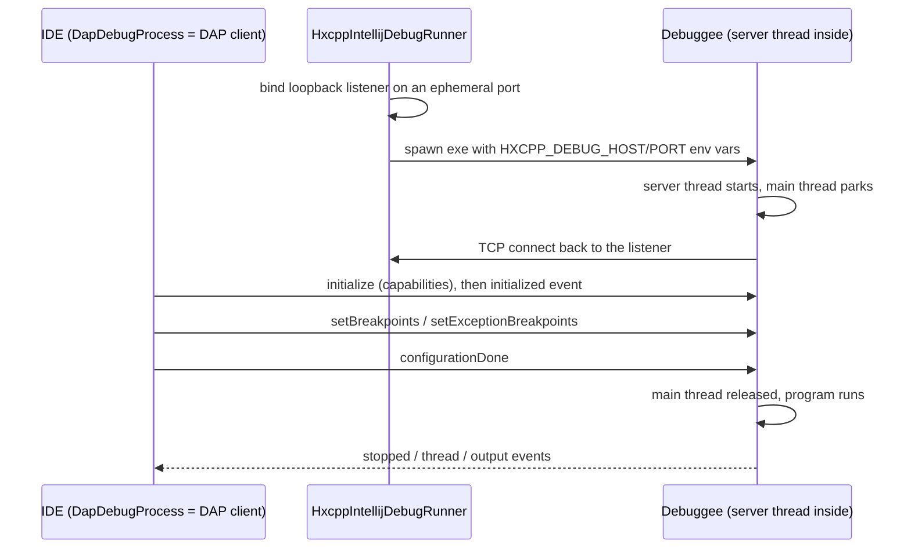
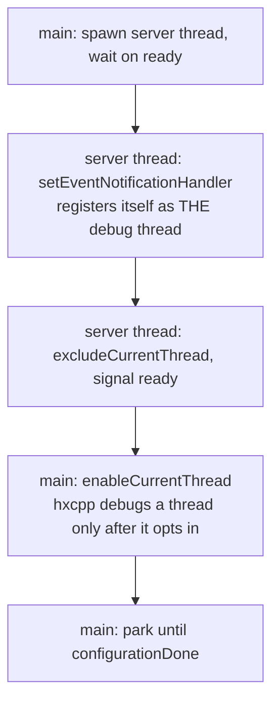
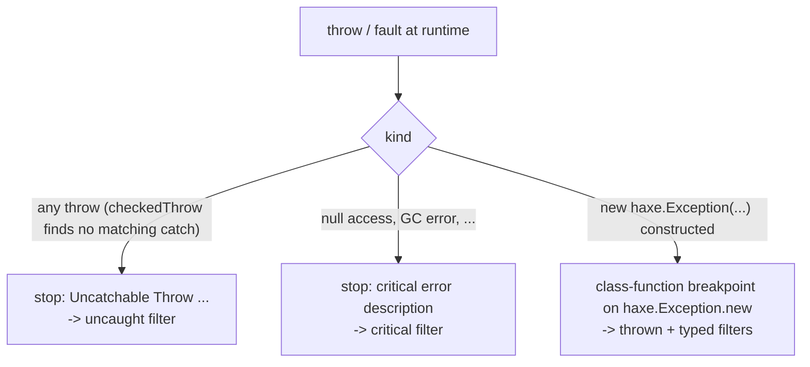

# intellij-hxcpp-debugger

An in-debuggee DAP debug server for HXCPP applications. The server is Haxe
code from the `intellij-hxcpp-debug-server` haxelib, compiled INTO the
debugged program; it speaks the Debug Adapter Protocol over TCP directly to
the IDE, driving hxcpp's built-in `cpp.vm.Debugger` engine from inside the
process. There is no external adapter process and no custom wire protocol.

This document is the entry point for anyone new to the code: how a session
connects, what is supported, the design decisions, how each feature works,
and the traps that will bite again.

## How it connects

The IDE picks a free loopback port per session and passes it to the debuggee
through environment variables — the server reads `HXCPP_DEBUG_HOST` /
`HXCPP_DEBUG_PORT` at startup (falling back to compile-time defines, then
`127.0.0.1:6972`) and connects OUT to the IDE. No rebuild is needed to change
ports and concurrent sessions cannot collide. A plain Run sets no variables:
the embedded server sees an unconfigured session and stays out of the way.



The debuggee must be compiled with `-lib intellij-hxcpp-debug-server` and
`-debug` (cpp target). The lib's `extraParams.hxml` runs
`--macro Macro.injectServer()`, which defines `HXCPP_DEBUGGER` (turning on
the runtime's checked throws and instrumentation hooks) and forces the
self-starting Server class into the build.

## Supported features

- **Launch** (run and debug) through the "HXCPP Application (IntelliJ)" run
  configuration. Attach mode is not implemented (deferred, see Decisions).
- **Line breakpoints** with conditions, verified line-level against a
  compile-time line table; run to cursor.
- **Stepping**: into / over / out, surfacing stops only when the source line
  changes; **smart step into** (pick which call on the line to enter, both
  Shift+F7 and the plain F7 chooser).
- **Pause**, **threads** (multi-threaded debuggees), **stack traces**.
- **Variables view**: structured expansion (arrays, objects, anon structures,
  enums), Set Value into ANY stack frame (bool/int/float/string literals).
- **Evaluate**: watches, hover, the evaluate dialog and conditional
  breakpoints — live in-process evaluation including real method calls,
  static access through dotted package paths, `new`, and assignments.
- **Exception breakpoints**: uncaught throws, critical errors (both default
  ON), the "thrown" haxe.Exception filter and per-class typed filters.
- **toString rendering toggle** (`custom/setToStringRendering`): object
  labels via `toString()` can be switched on live from the Variables view;
  OFF by default (running user code implicitly is opt-in — see Decisions).

## Dependencies

| What | Used for |
|---|---|
| `intellij-dap-protocol` haxelib (`debuggers/dap-protocol` src/main/haxe) | DAP request/response/event typedefs |
| `hscript` haxelib | expression parsing + interpretation for evaluate |
| hxcpp's `cpp.vm.Debugger` (std) + runtime hooks | the actual debug engine — nothing low-level is reimplemented |
| `:dap-protocol` Java module (IDE side) | `DapClient` the plugin connects with |

Toolchain floor: haxe 4.1+ (the plugin's floor); the server builds and runs
against haxe 4.1–5. Building the test fixtures needs haxe + hxcpp + a C++
toolchain; integration tests are opt-in via `-PdebuggerTests=true`.

## Module layout

```
hxcpp-debug-server/               the published library (server sources)
  src/ijhaxe/hxcpp/debug/           Server, Dispatcher, Macro, DebuggerApi, ...
src/test/haxe/                    interpreter-run unit tests (no C++ needed)
src/test/java/                    DAP integration tests against real fixtures
test-fixtures/                    debuggee programs compiled with the haxelib
```

The IDE side lives in the main plugin: the DAP machinery shared by every
DAP debugger (`DapDebugProcess`, breakpoints, stacks, values) under
`runner/debugger/dap/ide`, and this debugger's run configuration, runner and
`HxcppIntellijBackend` under `runner/debugger/hxcpp/intellij`.

---

## Decisions made

### Written fresh, behind a `DebuggerApi` seam

The server is not a fork of vshaxe's Server.hx (MIT; used as reference
material). The architecture is test-first: all `cpp.vm.Debugger` access goes
through the `DebuggerApi` interface — the real implementation is cpp-only, a
scriptable fake drives every unit test under the Haxe interpreter, so the
protocol/dispatch/value logic is testable without a C++ toolchain.

### Connection through env vars and an ephemeral port

Host/port are runtime configuration (env vars set by the IDE on the spawned
process), not compile-time defines. This removes the whole port-collision bug
class and allows any number of concurrent sessions. See "How it connects".

### Breakpoints on lines without code are rejected

A requested line absent from the line table is answered
`verified: false, "no executable code at this line (stale build?)"` and never
installed. The common cause is a binary that no longer matches the source
(code edited or commented back in without a recompile) — the hollow marker
surfaces that desync at breakpoint-set time instead of a breakpoint that
silently never stops. Mechanics under "Breakpoint line verification".

### No implicit user code on the server thread

Variable rendering runs on the server thread while every debuggee thread is
PAUSED. `Reflect.getProperty` invokes property getters — user code — and a
getter that needs a lock held by a paused thread blocks the server thread
forever: the session wedges, every request times out, resume never happens
(reproduced live with an `@:isVar` getter acquiring a mutex a paused thread
held). Rule: `Values` reads fields RAW (`Reflect.field`, never getters) and
labels objects by class name (never `Std.string`/`toString`, same hazard). An
`@:isVar` property therefore shows its backing value, not its computed one.
Running a getter is what `evaluate` is for — explicit and user-initiated.
(The Java debugger gets away with evaluating getters because it runs them ON
the suspended thread; hxcpp has no such primitive.)

### Fault isolation: a catchable fault never ends the session

A critical error on hxcpp's debug thread (the server thread) cannot stop that
thread; the runtime re-raises it as `hx::Throw("Critical Error in the
debugger thread")`. Real debuggees make this reachable just by being
INSPECTED — frames like a thread pool's dispatch loop hold raw pointers and
half-built state that fault the reflection reads (observed with OpenFL's
NyanCat sample, where vshaxe's renderer printed this exact error and its
deeper getProperty/toString chains crashed the app on `lime.app.Future`
frames). Without isolation the throw unwinds into the wire-death catch and
the server silently stops serving — indistinguishable from a freeze.

Hence isolation at three levels: every request is answered even when its
handler throws (`handleRequest`'s catch), every event dispatch is guarded
(Server loop), and every variable row degrades to `<unreadable: ...>` on its
own (`VariablesView.safeVariable`; the Evaluator skips corrupt locals). A
hard segfault still kills the process — nothing catches that — but a
catchable fault must never end the session. The serve loop logs why it ended
(`HXCPP_DEBUG_LOG`), because a silent exit is indistinguishable from a hang.

### Deliberately small v1 surface

Launch-only (attach deferred); one flat "Locals" scope per frame (hxcpp
exposes params + locals + `this` together); `setVariable` parses
bool/int/float/string literals (constructing objects through Set Value is out
of scope — `evaluate` assignments cover the rest).

---

## How features work

### The runtime debug engine (hxcpp 4.3.2, `cpp.vm.Debugger` + `src/hx/Debugger.cpp`)

The server is a protocol layer over a debug engine hxcpp already ships:

- **Breakpoints**: `addFileLineBreakpoint` / `addClassFunctionBreakpoint` /
  `deleteBreakpoint` — a complete, thread-safe engine (copy-on-write lists,
  quick-reject hash, so idle breakpoints are nearly free). Class-function
  breakpoints fire at function ENTRY (`frame->lineNumber == firstLineNumber`),
  which is what smart step into is built on. `getFilesFullPath()` and
  `getFiles()` are index-aligned parallel arrays — the basis of the suffix
  file matching.
- **Run control**: `stepThread(thread, INTO/OVER/OUT, count)`,
  `continueThreads`, `breakNow(wait)`. Steps compare stack depth against the
  break-time level; step and breakpoint checks are evaluated TOGETHER at
  every instrumentation point, so a temporary breakpoint is live during a
  step ("whichever lands first" needs no runtime support).
- **Stacks and stop reasons are field reads**: `ThreadInfo` carries the full
  frame list (fileName/lineNumber/className/functionName/parameters) and a
  status that distinguishes BREAK_IMMEDIATE / BREAKPOINT (+ number) /
  CRITICAL_ERROR (+ description) — no stack walker, no trap classification.
- **Variables are live `Dynamic`s**: `getStackVariables` /
  `getStackVariableValue`, expansion by ordinary reflection.
  `setStackVariableValue(thread, frame, name, value, unsafe)` writes to ANY
  frame and returns the value actually set — compare to detect silent misses.
  Statics need no debugger API at all (`Type.resolveClass` + `Reflect`).
- **Exceptions**: every throw funnels through `__hxcpp_dbg_checkedThrow`,
  which walks the enclosing frames' declared catch types — real typed
  uncaught-detection. Details under "Exception breakpoints".

### Threading model and the debug thread

`Debugger.setEventNotificationHandler` registers ITS CALLING THREAD as
hxcpp's one debug thread — the single thread excluded from ever breaking. The
handler MUST therefore be installed on the server thread, never on main; if
main registers it, main becomes the debug thread and no user-code breakpoint
can ever fire.



Stop notifications run ON the thread that stopped, while it is genuinely
suspended. `getThreadInfo(threadNumber, false)` must be read THERE, in the
handler — it delivers the status and hit-breakpoint number. Reading it later
from the server thread races the thread's state and returns STATUS_RUNNING,
silently misclassifying the stop. The full `StopInfo` is captured in the
handler and travels with the event; the server thread only formats and sends.

### Session lifecycle and the serve loop

- A debuggee whose main thread already exists fires THREAD_CREATED the
  instant its debugging is enabled — before the client has even sent
  `initialize`. The Dispatcher buffers all outbound debug events until it has
  answered initialize and emitted the `initialized` event, then flushes them
  in arrival order.
- The serve loop polls with `Socket.select([socket], …, timeout)` and reads
  only when readable. A blocking read with a timeout is not an option: the
  timeout surfaces as `haxe.io.Eof` on cpp — indistinguishable from a real
  disconnect — and would kill the loop the moment configuration finished.
  With select, an `Eof` from an actual read genuinely means the IDE hung up.
  The loop keeps spinning to drain runtime events while no request is
  pending.

### Run control and stepping

- `Debugger.continueThreads(specialThreadNumber, continueCount)` continues
  all stopped threads; `continueCount` is how many breakpoints the special
  thread SKIPS (0 = stop at the next). A plain resume passes the stopped
  thread's number with count 1. A wildcard/invalid number is wrong.
- `Debugger.stepThread(threadNumber, stepType, 1)` both arms the step AND
  continues the stopped thread — `continueThreads` must not be called after.
  It matches the thread by its debugger NUMBER (`getThreadInfos().number`,
  main = 0). STEP_INTO stops at the next line; STEP_OVER/OUT compare stack
  depth against the level captured when the thread broke.
- The runtime reports a step landing and a user pause with the SAME status
  (STOPPED_BREAK_IMMEDIATE). The Dispatcher disambiguates by tracking whether
  a step is in flight: a BREAK_IMMEDIATE stop during a step is reason "step"
  (re-stepping while the source line has not changed); otherwise "pause". A
  breakpoint or exception hit mid-step wins over the step.

### Smart step into

Target discovery is IDE-side: `PsiResolvedSmartStepHandler` walks the Haxe PSI
for the calls on the stopped line and resolves each to its declaring class
(the server has no line→calls knowledge — there is no bytecode to mine).
Choosing a variant sends the custom `custom/stepIntoFunction` request with
(className, functionName); the server installs a TEMPORARY class-function
breakpoint at the callee's entry racing a STEP_OVER — whichever lands first
is the stop, reported as a plain step, so a call that never executes
(short-circuit, conditional) degrades safely to a step over. Filtered out
IDE-side: closures/local functions (no runtime class/function name), `inline`
methods (no runtime function), externs (no instrumentation). Virtual-dispatch
caveat: the breakpoint is planted on the DECLARED class, so an override
called through a base-typed reference lands as a step over. Occurrence
handling for a callee invoked more than once on the line is documented in
`Dispatcher.hx`.

### Breakpoint line verification (the compile-time line table)

hxcpp keeps no queryable line table at runtime: the generated `HXLINE(n)`
markers are executed assignments, never registered anywhere — the runtime
happily installs a breakpoint on a comment line and it silently never fires.
The table is therefore baked at COMPILE time: `Macro.bakeLineTable` (a
`Context.onGenerate` walk over the typed AST, after DCE — the same positions
gencpp turns into HXLINE) collects each file's executable lines into a
`haxe.Resource`; `LineTable` reads it back and `Breakpoints` verifies each
requested line, rejecting lines without code (see Decisions). File resolution
reuses the FileMatcher suffix matching (same as the runtime keys, so moved
checkouts and CI-built binaries still resolve), and a binary WITHOUT the
resource (older lib build) degrades to file-level verification. Pinned by
`BreakpointsAndEvaluateIT.aLineWithoutCodeIsRejected` against a real compiled
fixture, which also pins that the table agrees with what hxcpp instruments.

### Stacks and frame ids

- The captured stack has the stop handler's own frames on top (getThreadInfo,
  the notification closure) because it is read inside the handler. Everything
  above the reported stop location — the innermost frame matching the
  handler's (file, line, function) — is trimmed, leaving a clean user stack.
  Stack order is innermost-LAST; DAP wants newest-first, so it is reversed
  when building the stackTrace response.
- Frame index 0 is the OUTERMOST frame (`__hxcpp_main`), not the top: the
  frame the debuggee stopped in is `stack.length - 1`. The DAP frame ids are
  these raw hxcpp indices (the trim only drops the tail, so surviving indices
  line up). Anything evaluating against "the current frame" — a conditional
  breakpoint's condition, a frameless `evaluate` — must default to
  `stack.length - 1`, NOT 0. Getting this wrong is silent: `amount` resolves
  to nothing in `__hxcpp_main`, hscript reads it as `null`, `null == 2` is
  `false`, and the conditional breakpoint suppresses EVERY hit instead of
  erroring.

### Variables

Because the server runs in-process, a local's value is a real Haxe object:
`Values` describes and expands it with `Type.typeof`/`Reflect` (arrays,
objects — data fields only, methods filtered — anon structures, enums), no
memory decoding. This all runs under the interpreter, so it is unit-tested
over plain values. `setStackVariableValue(thread, frame, name, value)` takes
a real frame number, so writes reach ANY frame — not just the top one.
`VariablesView` owns the DAP variablesReference registry (a reference names a
frame's locals or an expandable value) and `reset()`s it on every stop, since
a reference must never outlive its stop.

### Evaluate: hscript is reflection, not a sandbox

hscript does not interpret a copy of the program: every operation bottoms out
in `Reflect` on the REAL values bridged from the frame (`Interp.call` is
literally `Reflect.callMethod(o, f, args)`). So `box.addTo(7)` in a watch
runs the compiled method and mutates the real object, and the change persists
after resume — exactly like evaluate in the Java debugger. `ResolvingInterp`
additionally resolves type names, so static calls and `new` work too: bare
identifiers (`Counter.bump(5)`, `Std.int(x)`) resolve at execution time, and
dotted package paths (`my.pack.Target.fn(x)`) — which hscript parses as field
access on the free identifier `my` — are pre-bound by scanning the parsed AST
and materializing each resolvable dotted prefix as nested anonymous objects.
Binding only paths that actually resolve keeps unknown-identifier errors (and
the conditional-breakpoint fail-safe) intact.

Two boundaries: reassigning a frame LOCAL only persists through the explicit
`name = expr` write-back path (hscript's own scope is scratch); object-field
and static mutations need no help. And liveness cuts both ways — a careless
watch expression can change program behavior; that is inherent to in-process
evaluation.

### Exception breakpoints

The runtime reports EVERY exception-ish stop as
`STATUS_STOPPED_CRITICAL_ERROR` with a description string —
`STATUS_STOPPED_UNCAUGHT_EXCEPTION` exists in the std API but is never
emitted by hxcpp 4.3.2 (source-grepped). Three mechanisms cover the filters:



- **Uncatchable throw** (`"Uncatchable Throw: <value.toString()>"`): every
  `throw` in an HXCPP_DEBUGGER build runs `__hxcpp_dbg_checkedThrow`, which
  walks the enclosing frames' DECLARED catch types (`hx::CanBeCaught`) — real
  typed uncaught-detection. The thread stops AT the throw site BEFORE
  unwinding, so the full stack and locals are inspectable (verified live).
  Continue unwinds and terminates normally (`Error : <value>`).
- **Critical error** (`"Null Object Reference"`, GC errors, ...): with a
  debugger attached `hx::NullReference` calls `__hxcpp_dbg_fix_critical_error`
  UNCONDITIONALLY — a null access stops even inside a try/catch that would
  have caught it (verified live), a deliberate behavior difference from an
  undebugged run. Resume is NOT clean: the "fixup" path re-executes the
  faulting access, so continue re-stops or hard-crashes (0xC0000005
  observed). With the "critical" filter off, the Dispatcher caps consecutive
  silent resumes (MAX_SILENT_CRITICAL_RESUMES) so a resumable fault loop
  cannot livelock the session.
- **The "thrown" filter and typed filters**: generated code for
  `throw new haxe.Exception(...)` calls `haxe.Exception_obj::__alloc` — a
  HAXE constructor, and every subclass constructor chains through it via
  `super()`. One class-function breakpoint on `haxe.Exception.new` is
  therefore "break where a haxe.Exception (or subclass) is thrown" for the
  whole hierarchy, caught or not, with the concrete class read from `this`
  and the message from the ctor parameter ("AppError: kaboom"). The "thrown"
  filter (default OFF) reports every hook hit — reported unverified when the
  program never compiles haxe.Exception in. Typed filters (DAP `filterTypes`,
  the per-class breakpoints in the IDE) reuse the same hook: at each hit the
  server walks the class chain read off `this`
  (`Type.getClass`/`getSuperClass`) and matches dotted or bare names — so a
  base-class filter stops subclass throws, and subclasses with INHERITED
  constructors (no own `new` frame — the case a per-type entry breakpoint
  could never catch) still match. Non-matching constructions resume silently.

NOT SUPPORTABLE (and why):

- **Break on caught/all exceptions** — no HAXE-addressable hook. Re-confirmed
  from generated C++: every `throw` compiles to `HX_STACK_DO_THROW(e)` =
  `__hxcpp_dbg_checkedThrow(e)`, and every catch to `HX_STACK_BEGIN_CATCH` =
  `__hxcpp_stack_begin_catch()` — both are C++ runtime functions, not `.hx`
  class methods, so neither is reachable by the file-line or class-function
  breakpoint APIs. `checkedThrow` self-reports only uncatchable throws; a
  catchable one is a plain `hx::Throw`. There is no `haxe.Exception` wrapping
  in the throw path to hook either (`throw "x"`/`throw new E()` throw the
  value directly). The clean fix would be an upstream "break on all" flag
  consulted by `checkedThrow`.
- **Break on raw-value throws** (`throw "str"`, enums, ints) — these never
  construct a `haxe.Exception`, so the constructor hook cannot see them, and
  the runtime surfaces nothing for them until they are uncatchable.

Honest caveats: raw-value throws stay invisible (above); an Exception
constructed but never thrown still stops; a rethrow of an existing instance
does not re-stop. CONFIRMED WORKING (not a gap): ordinary LINE breakpoints
inside a try or a catch block fire normally — the filter limitation is a
separate mechanism (regression-tested in
`ExceptionsIT.lineBreakpointsInsideTryAndCatchFire`).

---

## Gotchas

### A loop-body breakpoint fires once, not once per iteration

hxcpp suppresses re-hitting a breakpoint on the SAME source line until
execution leaves that line. A breakpoint on a one-line loop body
(`for (…) total = add(total, i);`) therefore fires ONCE — the line never
"changes". A breakpoint inside a function CALLED from the loop fires every
call. Tests that need repeated hits use a called function's body line, never
the loop line (see the fixture's `add()`). This is the runtime's granularity,
the flip side of the "surface stops only on line change" stepping policy.

### Stepping needs at least one breakpoint armed

hxcpp only runs its per-line step/breakpoint check while at least one
breakpoint exists (`gShouldCallHandleBreakpoints`). A step issued when NO
breakpoints are set never stops — the thread runs to completion. Stepping is
reliable whenever any breakpoint is set (the common case, and what the tests
cover). A sentinel-breakpoint workaround was tried and did not reliably keep
the check armed; robust zero-breakpoint stepping is an open item (candidate:
an execution-trace toggle, if hxcpp exposes one).

### One-line call chains: step out/over never revisit the chain line

On `cfg.test1().test2().test3();` (all one line), stepping OUT of test1 lands
on the line AFTER the chain, and stepping over test1's last line lands inside
test2 — the chain line itself is never revisited. This is hxcpp codegen, not
the server: `__hxcpp_on_line_changed` fires only when a function's line
REGISTER changes, and between the chained calls the caller stays on the same
line — no instrumentation point executes at the caller's depth until the next
source line. So STEP_OUT's first eligible event is the next line, and
STEP_OVER's first same-depth event is inside the next callee (a sibling call
frame has the same depth as the one just left). Not fixable without runtime
changes; smart step into is the tool for navigating within such lines.

### hxcpp catches enums loosely — hscript errors became null

On hxcpp, a `catch` clause typed to one enum catches ANY thrown enum.
hscript's `Interp.exprReturn` wraps evaluation in `catch(e:Stop)` (its
internal control-flow enum) — on cpp that also caught hscript's `Error` enum,
matched no `Stop` case, and fell through to `return null`. Net effect: every
runtime evaluate error (unknown identifier, null access) silently produced
`null` on the native target while throwing correctly under the interpreter —
an interpreter-green/native-broken class of bug unit tests cannot catch,
which is exactly why every feature is also verified live.
`ResolvingInterp.execute` bypasses `exprReturn` (calls `expr` directly) and
re-handles the `Stop` cases by name, since `Stop` is module-private.
Residual: `exprReturn` is also used inside hscript-defined function bodies,
so an error inside a function DEFINED IN THE WATCH EXPRESSION still nulls on
cpp; not worth reimplementing `EFunction` over.

## Troubleshooting

- **Server lifecycle log**: set the `HXCPP_DEBUG_LOG` env var to a file path
  for a low-tech append log of the server's lifecycle (`Server.log`) — the
  practical way to trace an opaque multi-threaded live session. Off by
  default.
- **A breakpoint shows a hollow marker** with "no executable code at this
  line (stale build?)": the compiled binary does not have code on that line —
  usually the source changed after the last build. Rebuild.
- **Breakpoints never fire at all**: check the debug-thread registration
  ordering ("Threading model" above) — if the notification handler was
  installed from the main thread, main became the debug thread and can never
  break.
- **The session freezes while expanding variables**: a reflection read is
  blocking on user code or corrupt state. By design this should degrade to
  `<unreadable: ...>` rows; if a new freeze appears, suspect a new code path
  that runs user code on the server thread (see Decisions) and check
  `HXCPP_DEBUG_LOG` for where the loop stopped.
