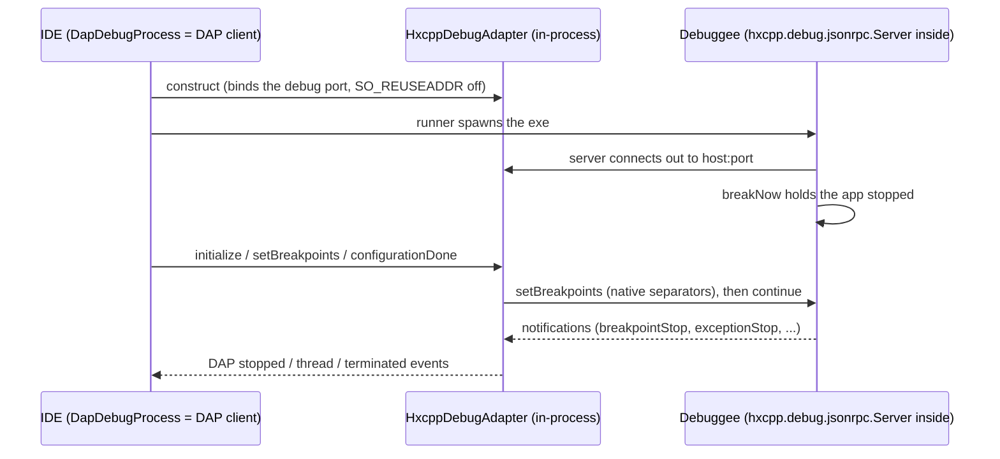

# vshaxe-hxcpp-debugger-adapter

An in-process Java DAP adapter for HXCPP programs built with the **vshaxe**
debug server — vshaxe/hxcpp-debugger's `hxcpp-debug-server` haxelib, the one
VS Code uses. The adapter translates between the IDE-facing DAP surface and
that server's custom jsonrpc wire protocol.

**This debugger exists for compatibility.** Projects that are also developed
in VS Code already build with `-lib hxcpp-debug-server`; this adapter debugs
those builds unchanged — no build modification, no second haxelib. For
everything else, `debuggers/intellij-hxcpp-debugger` (the
`intellij-hxcpp-debug-server` haxelib, native DAP) is the more capable
option: the limitations listed below are imposed by the vshaxe server's wire
protocol and server code, and cannot be fixed from the adapter side.

## How it connects

The adapter is in-process Java — no Node.js, no external process. The IDE's
`DapDebugProcess` is a plain DAP client talking to `HxcppDebugAdapter`
over a loopback socket pair (`HxcppVshaxeBackend`); the adapter speaks
jsonrpc to the debug server compiled INTO the debuggee.

The debuggee is compiled with `-lib hxcpp-debug-server -debug`; the lib's
macro compiles `hxcpp.debug.jsonrpc.Server` in. At startup that server tries
to CONNECT OUT to the debugger; host/port are **compile-time defines**
(`HXCPP_DEBUG_HOST` / `HXCPP_DEBUG_PORT`, default `127.0.0.1:6972`) — not
runtime configuration. The "HXCPP Application (vshaxe)" run configuration
prefills those defaults and appends the matching `-D` defines to builds it
triggers, so the build and the debugger always agree.

Launch flow: the adapter listens, the runner spawns the exe through the
IDE's ProcessHandler (console/stdin/exit code flow through normal run
machinery), the debuggee's server connects back and holds the app stopped
with its initial `breakNow`; `configurationDone` translates to the releasing
`continue` — so breakpoints are always in place before user code runs.

## Supported features

- **Launch** through the "HXCPP Application (vshaxe)" run configuration
  (attach mode not implemented — launch-only).
- **Line breakpoints** with conditions (evaluated by the server's own
  expression interpreter).
- **Stepping**: into / over / out (on the stopped thread), **pause**,
  **threads**, **stack traces** (artificial/native frames filtered).
- **Variables view** with structured expansion; **Set Value** and evaluate
  assignments — top stack frame only, with write verification (see below).
- **Evaluate** for watches/hover via the server's interpreter (read-only;
  assignments are routed through `setVariable`).
- **Uncaught exception stops** (the server's built-in behaviour).

## Limitations (vs. the intellij HXCPP debugger)

All server/protocol-imposed; the adapter papers over what it can and
reports honestly what it cannot:

| Limitation | Cause | intellij-hxcpp-debugger |
|---|---|---|
| Debug port is a COMPILE-time define; leftover instances poison it | `HXCPP_DEBUG_HOST/PORT` are `Context.definedValue` defines | env vars + ephemeral port per session |
| Writes reach ONLY the top stack frame; deeper writes are refused | `setVariable` hardcodes the top frame server-side and silently "succeeds" | writes to any frame |
| Breakpoint files matched by EXACT full path — moved projects / CI builds miss | server's `path2Key` lookup, no suffix matching over the protocol | suffix matching against the runtime file tables |
| No line-level breakpoint verification | the server verifies nothing per line | compile-time line table, non-code lines rejected |
| No exception filters (uncaught only, quirky delivery) | `setExceptionOptions` has NO server-side handler (null-success) | uncaught/critical/thrown/typed filters |
| No smart step into | no such request in the wire protocol | `custom/stepIntoFunction` |
| No toString-rendering control | the server ALWAYS `Std.string()`s objects | live gear toggle, raw reads by default |
| Multi-expression lines re-hit breakpoints once per sub-expression | hxcpp traps at expression granularity, surfaced as-is by the server | server-side "surface stops only on line change" policy |

## Dependencies

| What | Used for |
|---|---|
| `hxcpp-debug-server` haxelib (pinned to the latest release) | the debug server compiled into the DEBUGGEE |
| `:dap-protocol` Java module | DAP POJOs + the `DapClient` the plugin connects with |
| own `jsonrpc` package (zero IDE deps) | framing, message model, request/response correlation |

The IDE side lives in the main plugin: the DAP machinery shared by every
DAP debugger (`DapDebugProcess`, breakpoints, stacks, values — behind the
`DapBackend` interface) under `runner/debugger/dap/ide`, and this debugger's
run configuration, runner and `HxcppVshaxeBackend` under
`runner/debugger/hxcpp/vshaxe` (the intellij-server variant lives beside it
in `hxcpp/intellij`). This module provides `HxcppDebugAdapter`, the
vshaxe-protocol backend the runner plugs in.

---

## How it works

### The wire protocol

Framing: 4-byte little-endian length prefix + UTF-8 JSON body. Requests
`{id, method, params}` → responses; notifications from the server have no
id. Two server quirks shape the client code:

- **Responses are the request object echoed back** with `result`/`error`
  filled in — so responses also carry the request's `method` and `params`,
  and message classification must key on the presence of `id` alone
  (`JsonRpcJson`). Every request gets a response, including Void-result
  methods like `pause`/`continue`.
- **Unknown methods return a null-result SUCCESS.** Server dispatch handles
  only a subset of its own Protocol.hx: `switchFrame`,
  `setExceptionOptions`, `setBreakpoint` and `removeBreakpoint` have NO
  handler, and an unhandled method falls through to a response with a null
  result and no error. A call to them "succeeds" while doing nothing — this
  masked a misuse of `switchFrame` for a while. Never rely on a success
  response as proof a method exists; check the server dispatch first.
  Consequence: `setExceptionBreakpoints` is an honest adapter-side no-op.

### Breakpoint paths: native separators, exact match

The server resolves a breakpoint's file by exact string lookup against the
compiler-recorded full paths (`path2file[path2Key(params.file)]`, where
path2Key only UPPERCASES on Windows — no separator normalization, no suffix
matching). IntelliJ's VirtualFile paths use FORWARD slashes on Windows; the
compiler records backslashes. The lookup misses, the breakpoint registers
against a null file, and there is no error — the server happily returns an
id while the program never stops.

The adapter converts client paths to native separators before every
setBreakpoints (`toDebuggerPath`); the launch integration test deliberately
sends IDE-shaped forward-slash paths so a real stop pins the conversion.
Any new request that carries a file path to the server needs the same
conversion. The match is still EXACT full-path: an executable compiled from
sources at a different location than the project opened in the IDE (moved
project, CI build) will not match — suffix matching would need server-side
support.

### Writes: assignment routing and verification

Two independent server facts drive this design:

- The server's `evaluate` NEVER writes: its interpreter computes the
  expression's value (assignment included) without touching the debuggee.
  Writes must go through `setVariable`, whose value parameter is a LITERAL
  (quotes stripped; not evaluated).
- `setVariable` HARDCODES the top stack frame of the stopped thread
  (`currentThreadInfo.stack.length - 3` in Server.hx). `switchFrame` does
  not change that, and a variable that does not exist in the top frame is
  silently ignored — the server still reports success.

So the adapter recognises top-level assignments in evaluate
(`topLevelAssignment` — outside quotes/brackets, not a comparison),
evaluates a non-literal right side first, routes the write through
`setVariable`, and VERIFIES every write (evaluate + F2 setValue) by
re-reading the target: an unchanged value becomes an error naming the
top-frame-only limitation instead of a silent lie. The IDE-side evaluator
refreshes the variable views after a successful assignment. Only variables
of the STOPPED function can be modified; anything deeper is refused with the
explanatory error.

### Translation mismatches the adapter absorbs

| DAP | jsonrpc protocol | Translation |
|---|---|---|
| `next/stepIn/stepOut(threadId)` | no threadId; stepping acts on the server's current thread | track/assert the stopped thread; steps only valid while stopped |
| `setVariable(variablesReference, name, value)` | `setVariable(expr, value)` — expression path | reconstruct an expression path from the reference tree; numeric child names become index expressions (`items[3]`) |
| `stopped(exception)` carries threadId | `exceptionStop{text}` has no threadId | report thread 0 |
| `variablesReference` lifetime per stop | server clears its references on each stop | mirror DAP rules; stale references after a resume are refused |
| verbose object values | server prints "ShortName, Std.string(obj)" — the class name TWICE without a custom toString | drop the doubled class-name prefix; keep the informative part (`Widget#3`) |

### Native frames and artificial frames

Stack frames without Haxe source (native/system frames) carry `"?"` as
their source path — in path-mangled forms that make `Path.of` throw. Any
unparseable source is treated as "no source" (frame without navigation),
never as an error that fails the whole stackTrace request. Frames the
server marks `artificial` are dropped.

### Uncaught exceptions: stop first (as "pause"), classify later

With the debugger attached, an uncaught throw STOPS the debuggee at the
throw line — but the server reports that first stop as `pauseStop`, not
`exceptionStop` (the critical-error classification happens later in the
unwind). Continuing then yields an exception-reason stop carrying the
thrown text and/or the process dying with its Critical Error output; the
final continue races the process's death (a failed continue there is
expected). Caught exceptions never stop, and there is nothing to configure.
Pinned by `HxcppUncaughtExceptionIntegrationTest`.

---

## Gotchas

### A leftover debuggee instance poisons the debug port

Symptom: every debug session fails — the spawned program prints
`Failed to connect to vsc debugger server at 127.0.0.1:<port>`, runs to
completion, then dies with `Critical Error: Uncatchable Throw: Bind failed`
(exit 0xC0000005), and the IDE times out waiting for the `launch` response.

Cause: the debug server compiled into the program does two things at
startup (Server.hx): try to CONNECT OUT to the debugger; if that fails,
BIND the port itself and wait for a debugger to attach (`waitForAttach`),
on a thread that keeps the process alive forever — so a plain Run of a
debug build "never exits" after main() completes. That leftover instance
holds the port in a state where later instances can neither connect to it
nor bind it themselves: each newly spawned debuggee crashes on startup with
`Bind failed`. Reproduced exactly: start the fixture once with no debugger
listening (the "orphan"), start it again → the second instance prints
precisely the failure sequence above.

Mitigations in place:

- `HxcppDebugAdapter` binds with `SO_REUSEADDR` off, so an occupied port
  fails the session upfront with the port-busy message instead of silently
  double-binding (Windows would otherwise sometimes allow it).
- `DapDebugProcess` watches the debuggee's process handler: death before
  the `launch` handshake completes fails the session IMMEDIATELY with the
  exit code and the leftover-instance hint, instead of a 30 s timeout.
- The run-configuration hint warns that debug builds wait for a debugger
  under plain Run and may never exit.

Anything that leaves debuggee processes behind (crashed sessions, killed
IDE) recreates the poisoned port.

### Multi-expression lines hit their breakpoint once per expression

A breakpoint on a line containing embedded iteration — e.g. an array
comprehension `var items = [for (i in 0...n) i * 10];` — stops once per
iteration, not once per line. Stepping over such a line re-lands on it
repeatedly, and plain run-to-cursor keeps getting intercepted by it
(breakpoints win over the run-to target by design, same as IntelliJ's Java
debugger). hxcpp traps at EXPRESSION granularity and this server surfaces
every re-entry; there is no way to tell "same statement, next comprehension
iteration" from "next loop pass" at the protocol level. Force Run to Cursor
works: the platform temporarily unregisters breakpoints through the
handler, so the server has none armed.

### Fixture builds and the compile-time port

`HXCPP_DEBUG_HOST`/`HXCPP_DEBUG_PORT` are compile-time defines, so the test
fixture pins port 6973 (non-default) to never collide with a real session
on 6972; integration tests serialize on that port.

### Moving/renaming this module breaks fixture builds two ways

- hxcpp object files embed absolute paths: after any directory change the
  incremental link fails with `LNK2011: precompiled object not linked in` —
  delete `build/hxcpp` once and rebuild.
- Windows MAX_PATH (260): haxe writes generated files with paths built from
  its cwd WITHOUT normalizing, so a `test-fixtures/../` segment counts
  toward the limit. The fixture tasks therefore run haxe from the MODULE
  ROOT with `test-fixtures/`-relative hxml paths; the longest generated
  name (GenericStackIterator_hxcpp_debug_jsonrpc_eval_Token.cpp) sits close
  enough to the limit that a deeper module path plus the unnormalized
  segment failed with a misleading `Sys_error(... No such file or
  directory)` while the file plainly existed.

## Troubleshooting

- **Every session fails with connect/bind errors**: check for a leftover
  debuggee process first (`Get-Process` for the program name) — see the
  poisoned-port gotcha.
- **Breakpoints show as set but never stop**: the executable was probably
  compiled from a different source location than the project (moved
  checkout, CI build) — the server's exact-path matching cannot resolve
  them. Rebuild locally.
- **A debug build "never exits" under plain Run**: expected — the embedded
  server binds the port and waits forever for a debugger. Kill it manually
  (and see the poisoned-port gotcha for what it does to the next session).
- **Exception breakpoints do nothing**: expected — the wire protocol has no
  working exception filters; only the built-in uncaught stop exists.
